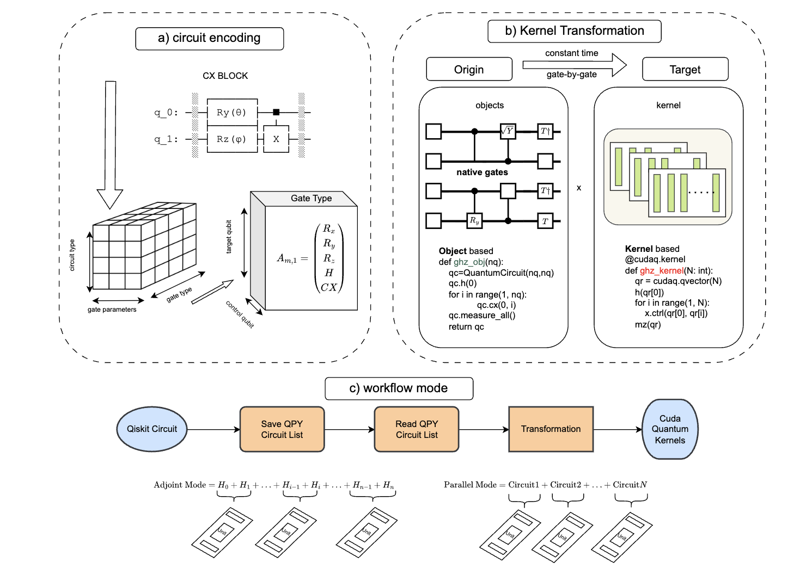
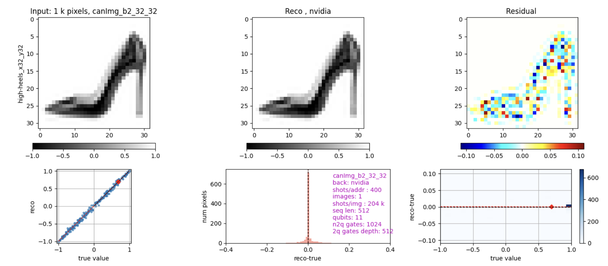

# qgear


<!-- WARNING: THIS FILE WAS AUTOGENERATED! DO NOT EDIT! -->

> paper link: https://arxiv.org/pdf/2504.03967



## Let’s assume you already have a computational GPU node allocated on HPC

## Checking the NVIDIA GPU

`nvidia-smi`

## Create a env (we do not recommend using default such .local / HOME)

> the way we choose is high performance lustre file system

``` bash
module load conda
conda create --prefix=/pscratch/sd/{location}/{username}/qgear -y python=3.11 pip
conda activate $SCRATCH/qgear
```

## Now make a working jupyter kernel

    pip install ipykernel
    python -m ipykernel install --user --name qgear --display-name qgear

## All in one

    pip install qgear

## Usage

### NERSC jupyter

https://jupyter.nersc.gov/

### Pypi

https://pypi.org/project/qgear/

### Fire up the example by choosing your qgear kernel

#### simple speed up with random circuit and QFT

https://gzquse.github.io/qgear/examples.html

#### quantum image encoding

> see appendix F in the paper
https://gzquse.github.io/qgear/apps.html



## local development

``` sh
. ./pm_martin.dev.source

# make sure qgear package is installed in development mode
https://nbdev.fast.ai/tutorials/tutorial.html
pip3 install -e '.[dev]'
pip3 install qgear

# compile to have changes apply to qgear
nbdev_prepare
```

### Goal

build the versatile all-in-one quantum accelerator for HPC-QPU hybrid
regime that supports all the mainstream quantum frameworks.
