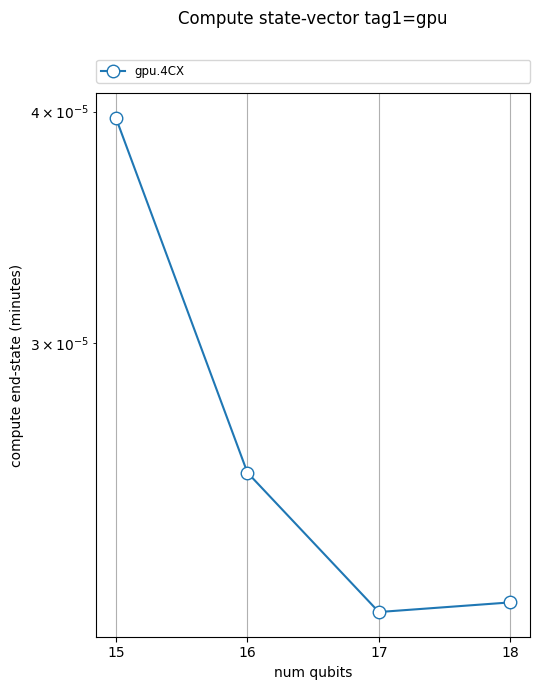
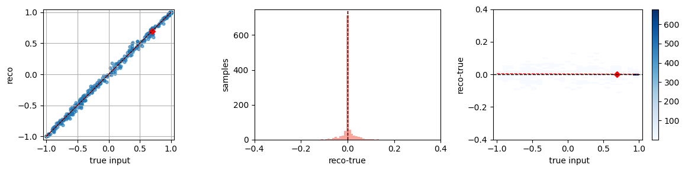
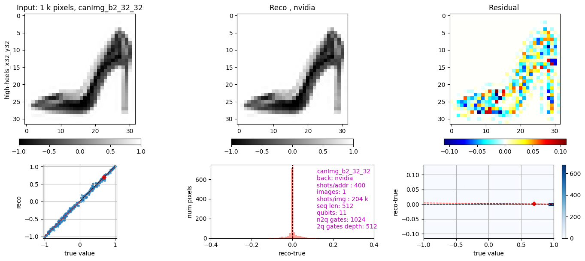
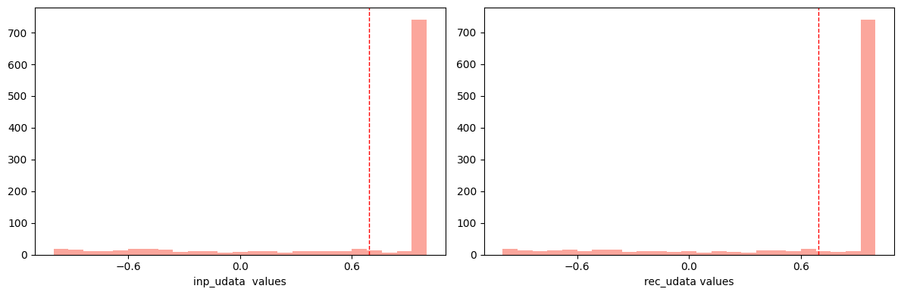

<!-- WARNING: THIS FILE WAS AUTOGENERATED! DO NOT EDIT! -->

### Application

``` python
from qgear.runner import generate_random_run
for i in range(15, 19):
    outf = generate_random_run(numCX=4, numCirc=1, numQubits=i, backend='nvidia', shots=1024)
```

    saving data as hdf5: /qgear/circ/rcirc_759e5d.gate_list.h5
    h5-write : circ_type (1, 2) int32
    h5-write : gate_type (1, 12, 3) int32
    h5-write : gate_param (1, 12) float32
    h5-write : meta.JSON as string (1,) object
    closed  hdf5: /qgear/circ/rcirc_759e5d.gate_list.h5  size=0.01 MB, elaT=0.0 sec
      closed  yaml: /qgear/meas/rcirc_759e5d_gpu_fp32.yaml  size=0.3 kB   elaT=0.0 sec
    saving data as hdf5: /qgear/circ/rcirc_1d8331.gate_list.h5
    h5-write : circ_type (1, 2) int32
    h5-write : gate_type (1, 12, 3) int32
    h5-write : gate_param (1, 12) float32
    h5-write : meta.JSON as string (1,) object
    closed  hdf5: /qgear/circ/rcirc_1d8331.gate_list.h5  size=0.01 MB, elaT=0.0 sec
      closed  yaml: /qgear/meas/rcirc_1d8331_gpu_fp32.yaml  size=0.3 kB   elaT=0.0 sec
    saving data as hdf5: /qgear/circ/rcirc_895368.gate_list.h5
    h5-write : circ_type (1, 2) int32
    h5-write : gate_type (1, 12, 3) int32
    h5-write : gate_param (1, 12) float32
    h5-write : meta.JSON as string (1,) object
    closed  hdf5: /qgear/circ/rcirc_895368.gate_list.h5  size=0.01 MB, elaT=0.0 sec
      closed  yaml: /qgear/meas/rcirc_895368_gpu_fp32.yaml  size=0.3 kB   elaT=0.0 sec
    saving data as hdf5: /qgear/circ/rcirc_2f136e.gate_list.h5
    h5-write : circ_type (1, 2) int32
    h5-write : gate_type (1, 12, 3) int32
    h5-write : gate_param (1, 12) float32
    h5-write : meta.JSON as string (1,) object
    closed  hdf5: /qgear/circ/rcirc_2f136e.gate_list.h5  size=0.01 MB, elaT=0.0 sec
      closed  yaml: /qgear/meas/rcirc_2f136e_gpu_fp32.yaml  size=0.3 kB   elaT=0.0 sec

``` python
from qgear.plotter import metrics_plot

# Only specify the date folder(s)
metrics_plot()
```

      read  yaml: /qgear/meas/rcirc_1e488a_gpu_fp32.yaml
      read  yaml: /qgear/meas/rcirc_2f136e_gpu_fp32.yaml
      read  yaml: /qgear/meas/rcirc_759e5d_gpu_fp32.yaml
      read  yaml: /qgear/meas/rcirc_895368_gpu_fp32.yaml
      read  yaml: /qgear/meas/rcirc_1cd31f_gpu_fp32.yaml
      read  yaml: /qgear/meas/rcirc_c66957_gpu_fp32.yaml
      read  yaml: /qgear/meas/rcirc_1d8331_gpu_fp32.yaml
      read  yaml: /qgear/meas/rcirc_970685_gpu_fp32.yaml
    PlotterBackbone: Running in Jupyter → using inline backend
    MetricsPlotter : Graphics started
    Graphics saving to  out/metrics_f1.png



``` python
from qgear.image import create_img
from qgear.runner import run_qcrank
from qgear.plotter import process_qcrank_experiment

# Step 1: Create input
create_img(tag="b2", inp_path=None, out_path="out")

# Step 2: Run simulation
run_qcrank("canImg_b2_32_32", inp_path="out", out_path="out", exp_name="canImg_b2_32_32")

# Step 3: Post-process and plot
process_qcrank_experiment("canImg_b2_32_32", inp_path="out", out_path="out", show_plots="abc")
```

    Loading built-in image 'high-heels_x32_y32.png' from qgear/data/
    Metadata: {'image_name': 'high-heels_x32_y32', 'image_shape_xy': [32, 32], 'image_pixels': 1024, 'canned_type': 'gray_image'}
    Normalized image min/max: -1.0, 1.0
    Flattened image shape: (1024,), reshaped: (2, 512)
    saving data as hdf5: out/canImg_b2_32_32.qcrank_inp.h5
    h5-write : phys_image (32, 32) uint8
    h5-write : image_name as string (1,) object
    h5-write : norm_image (32, 32) float32
    h5-write : inp_udata (1, 2, 512) float32
    h5-write : inp_fdata (512, 2, 1) float32
    h5-write : meta.JSON as string (1,) object
    closed  hdf5: out/canImg_b2_32_32.qcrank_inp.h5  size=0.02 MB, elaT=0.0 sec
    Saved QCrank input: out/canImg_b2_32_32.qcrank_inp.h5
    read data from hdf5: out/canImg_b2_32_32.qcrank_inp.h5
    read str: image_name 1 <class 'numpy.ndarray'>
    read obj: inp_fdata (512, 2, 1) float32
    read obj: inp_udata (1, 2, 512) float32
    read str: meta.JSON 1 <class 'numpy.ndarray'>
    read obj: norm_image (32, 32) float32
    read obj: phys_image (32, 32) uint8
     done h5, num rec:5  elaT=0.0 sec
    {'canned': {'canned_type': 'gray_image',
                'image_name': 'high-heels_x32_y32',
                'image_pixels': 1024,
                'image_shape_xy': [32, 32]},
     'payload': {'nq_addr': 9,
                 'nq_fdata': 2,
                 'num_clbit': 11,
                 'num_sample': 1,
                 'qcrank_max_fval': 3.141592653589793,
                 'seq_len': 512},
     'short_name': 'canImg_b2_32_32',
     'submit': {'num_shots': 204800}}
    M: using backend=nvidia, total shots=204800
    M: circuit has 11 qubits
    circ_orig depth_aziz: {'cx': 512, '2q': 512, '3q': 0, '4q+': 2, '1q': 514} , ops: {'ry': 1024, 'cx': 1024, 'measure': 11, 'h': 9, 'barrier': 2, 'qubits': 11}

    /usr/local/lib/python3.10/dist-packages/qiskit/compiler/transpiler.py:269: UserWarning: Providing `coupling_map` and/or `basis_gates` along with `backend` is not recommended, as this will invalidate the backend's gate durations and error rates.
      pm = generate_preset_pass_manager(

    circ_transpMeta:
    {'1q_gate_count': 1033,
     '2q_gate_count': 1024,
     '2q_gate_depth': 512,
     'num_qubit': 11,
     'phys_qubits': [0, 1, 2, 3, 4, 5, 6, 7, 8, 9, 10],
     'transpile_backend': 'nvidia'}
    M: execution-ready 1 circuits on 11 qubits on nvidia
    qiskit_to_gateList: nGate 2070
    saving data as hdf5: out/canImg_b2_32_32.gate_list.h5
    h5-write : circ_type (1, 2) int32
    h5-write : gate_type (1, 2070, 3) int32
    h5-write : gate_param (1, 2070, 3) float32
    h5-write : meta.JSON as string (1,) object
    closed  hdf5: out/canImg_b2_32_32.gate_list.h5  size=0.06 MB, elaT=0.0 sec
    read data from hdf5: out/canImg_b2_32_32.gate_list.h5
    read obj: circ_type (1, 2) int32
    read obj: gate_param (1, 2070, 3) float32
    read obj: gate_type (1, 2070, 3) int32
    read str: meta.JSON 1 <class 'numpy.ndarray'>
     done h5, num rec:3  elaT=0.0 sec
    M: job canImg_b2_32_32 started, nCirc=1, nq=11, shots/circ=400, target=nvidia
    RCQ: done 901 nvidia, elapsed 1.32s
    Job QA: {'status': 'JobStatus.DONE', 'num_circ': 1, 'num_clbits': 11, 'device': 'GPU', 'method': 'statevector', 'noise': 'ideal', 'shots': 204800, 'time_taken': 1.3186101913452148}
    saving data as hdf5: out/canImg_b2_32_32.h5
    h5-write : image_name (1,) object
    h5-write : inp_fdata (512, 2, 1) float32
    h5-write : inp_udata (1, 2, 512) float32
    h5-write : norm_image (32, 32) float32
    h5-write : phys_image (32, 32) uint8
    h5-write : raw_nkey (1,) int32
    h5-write : raw_ikey (1, 901) int32
    h5-write : raw_mshot (1, 901) int32
    h5-write : meta.JSON as string (1,) object
    closed  hdf5: out/canImg_b2_32_32.h5  size=0.03 MB, elaT=0.0 sec
    read data from hdf5: out/canImg_b2_32_32.h5
    read str: image_name 1 <class 'numpy.ndarray'>
    read obj: inp_fdata (512, 2, 1) float32
    read obj: inp_udata (1, 2, 512) float32
    read str: meta.JSON 1 <class 'numpy.ndarray'>
    read obj: norm_image (32, 32) float32
    read obj: phys_image (32, 32) uint8
    read obj: raw_ikey (1, 901) int32
    read obj: raw_mshot (1, 901) int32
    read obj: raw_nkey (1,) int32
     done h5, num rec:8  elaT=0.0 sec
    rec_udata: (1, 2, 512) addrBitsL: [2, 3, 4, 5, 6, 7, 8, 9, 10]
    ic=0 marginal ibit=0 done, elaT=0.0 min
    ic=0 marginal ibit=1 done, elaT=0.0 min
    saving data as hdf5: out/canImg_b2_32_32.post.h5
    h5-write : image_name (1,) object
    h5-write : inp_fdata (512, 2, 1) float32
    h5-write : inp_udata (1, 2, 512) float32
    h5-write : norm_image (32, 32) float32
    h5-write : phys_image (32, 32) uint8
    h5-write : raw_ikey (1, 901) int32
    h5-write : raw_mshot (1, 901) int32
    h5-write : raw_nkey (1,) int32
    h5-write : rec_udata (1, 2, 512) float64
    h5-write : rec_norm_image (32, 32) float64
    h5-write : meta.JSON as string (1,) object
    closed  hdf5: out/canImg_b2_32_32.post.h5  size=0.04 MB, elaT=0.0 sec
    PlotterBackbone: Running in Jupyter → using inline backend
    Plotter : Graphics started
    plotted  high-heels_x32_y32
    Graphics saving to  out/canImg_b2_32_32_f1.png
    Graphics saving to  out/canImg_b2_32_32_f2.png
    Graphics saving to  out/canImg_b2_32_32_f3.png







    ({'image_name': array([b'high-heels_x32_y32'], dtype=object),
      'inp_fdata': array([[[0.   ],
              [0.   ]],
      
             [[0.   ],
              [0.   ]],
      
             [[0.   ],
              [0.   ]],
      
             ...,
      
             [[0.   ],
              [2.11 ]],
      
             [[0.   ],
              [0.857]],
      
             [[0.   ],
              [0.   ]]], shape=(512, 2, 1), dtype=float32),
      'inp_udata': array([[[ 1.   ,  1.   ,  1.   , ..., -0.514,  0.655,  1.   ],
              [ 1.   ,  1.   ,  1.   , ...,  1.   ,  1.   ,  1.   ]]],
            shape=(1, 2, 512), dtype=float32),
      'norm_image': array([[1.   , 1.   , 1.   , ..., 1.   , 1.   , 1.   ],
             [1.   , 1.   , 1.   , ..., 1.   , 1.   , 1.   ],
             [1.   , 1.   , 1.   , ..., 1.   , 1.   , 1.   ],
             ...,
             [1.   , 1.   , 0.953, ..., 1.   , 1.   , 1.   ],
             [1.   , 1.   , 1.   , ..., 0.992, 1.   , 1.   ],
             [1.   , 1.   , 1.   , ..., 1.   , 1.   , 1.   ]],
            shape=(32, 32), dtype=float32),
      'phys_image': array([[255, 255, 255, ..., 255, 255, 255],
             [255, 255, 255, ..., 255, 255, 255],
             [255, 255, 255, ..., 255, 255, 255],
             ...,
             [255, 255, 249, ..., 255, 255, 255],
             [255, 255, 255, ..., 254, 255, 255],
             [255, 255, 255, ..., 255, 255, 255]], shape=(32, 32), dtype=uint8),
      'raw_ikey': array([[ 984,  300, 1668, 1864,  160,  324,  268,  412,  668,  792,  440,
               800,  864,  248,  504, 1548,  320,   48, 1342,  404, 1364, 1964,
              1094,  288, 1932,  252,  264, 1556, 1616,  176,  632,  700,  124,
               768, 1536,  296,  232,  516,  276, 2044,  272,  520,  308, 1836,
              1408,  544,  304,   40,  424,  164,   16, 1552,  648, 1028, 1540,
              1796, 1952,  168,  152, 1956, 1948,  572, 1276, 1488,  108,  970,
               512,  312,  184,   68,  860, 1660, 1338,  280,  364,  284,  352,
               144, 1976,  396, 1020, 1712,  556, 1692,   60,  608, 1688, 1404,
              1032, 1112,  696,  376, 1036,  524,  780,  236,  718,  388,  788,
               552, 1832, 1016,  676,  604,  640, 1920, 1544,  156,  732,  466,
                32,  488,   24,  664,  856, 1804, 1868, 1708,  316,  892, 1326,
               416,   72, 1960, 1816,  652, 1852,  380,  448,  480, 1840,  760,
                 4, 1716,  796,  988, 2009, 1664,  432,  900,  564, 1820, 1792,
              1968,  644, 1612, 1860, 1236,   12, 1645,    8,  776, 1736,  772,
               660,    0,  680, 1240,   44, 1980, 1148, 1517, 1696,  688, 1928,
              1704, 1940,   52,  684,  444,  594, 1334, 1381,  128,  904, 1944,
               120,  196,  356,  528, 1672, 1992, 1284,  804, 1889, 1152,  384,
              1740, 1765,  392,   56, 1156,  420,  492,  888,   36,  532,  692,
               540, 1788, 1680,  560,  536, 1412, 2013,  896,  400, 1936,  484,
               508, 1828, 1972,  612,  916, 1202, 1350, 1222,  256,  260, 1812,
              1218, 1024, 1808,  568,  148,  636,   90,  192, 1800,   28, 1684,
              1474,   64,  104,  408,  132, 1916,  764, 1856,  228, 1116, 1226,
               616, 1732, 1988,  548,  992,  908, 1984,  912,  736,  136, 1844,
               172, 1206,  784, 1924,  656, 1700,  740,  338,  214,  188,  576,
               672, 1330, 1470, 1641,  920, 1253,  292, 1824, 1848, 1492,  140,
               428, 1322, 1160,  112, 1885,  704,   20, 1761, 1769, 1133, 1280,
              1058, 1210, 1466,   86,  846, 1728,  328,  180, 1509,  456, 1996,
              1505, 1724, 1454,  824,  436,  360, 1108,  204, 1098, 1261,  960,
              1720, 1633, 1054, 1478,  816, 1358,  240, 1346,  590,  342,  584,
              1368,  200,  708,  836,  218, 1462,  873, 1102,  580, 1676, 1214,
              1872, 2028, 1230, 1532, 1389, 1416, 1354,  808, 1757,  868, 1560,
              1450, 1257, 1458, 1001, 1620,  332, 1005,  924,  476, 1040, 2040,
               812, 1608,  974, 1529,   76, 1106, 1438, 1744,  728,  722, 1244,
              1781, 1901,  452, 1385, 1401, 1482, 1318, 1777, 1881, 1294, 1564,
              1062, 1637, 2000, 1748, 1174, 1129, 1420,  118,  368, 1568,  496,
              1629,  820, 1442, 1893, 1496,  948, 1198, 1909, 2037, 1657,  470,
              1912,   94,  978, 1773, 1360, 1314, 1434,  474,  624, 1624, 1084,
              1080,  956,   98,  850, 1446,  832,  952,  842,  726, 1905,  934,
               222,  346, 2017,  620, 1377, 1602, 1372,  828,   80,  100, 2021,
              1050,  944, 1120, 1513, 1484, 1170, 1897,  598,  224, 1076, 1125,
              1876, 1306, 1594, 1430, 1302,  749, 2005, 1572,  374, 1598,  877,
              1298,  854, 1144,  940, 1066, 1273, 1590, 1310,  938,  980, 1072,
              1784,  210,  966, 1164, 1653, 2024, 1649, 1290, 1184,  246, 1582,
              1178,  928, 1068, 1194,  602, 2032, 1586,  350, 1090, 1424, 1188,
               881, 1044,  744, 1753,  600,  712, 1604, 1141,  756, 1500, 1234,
              1013, 1576,  628,  745,  462,  997, 1578, 1182, 1249,  460, 1180,
               502, 1501,  964,  996, 1606, 1785,  372, 2025,  876, 1248, 1426,
              1136, 1584, 1192, 1580, 1064,  630, 1166, 1592,  884, 1600, 1752,
              1190, 1588,  752,  852,  758, 1269, 1074,  208, 1428, 1088, 1264,
              1308, 1186, 1145, 2004,  714,  500,  348,  930, 2033, 1232, 1070,
              1046, 1521, 1574,  942, 1288, 1176, 1300, 1296,  936, 1272,  982,
              1168,  226, 1009, 1172, 1078, 1304,  116, 1396,  748, 1121, 1008,
              1393, 1422, 1392, 1596,  753,  244, 1015, 1397,  848, 1512, 1124,
              1373,  596,  621, 1268, 1525, 1137, 1524, 1292,  472,  946,  954,
              1486, 1877, 1048,  220, 1086,  958, 1312,  976, 1780, 1904, 1625,
              1432, 1520,  344, 1265, 1104, 1648, 1652,   82,  724, 1400, 2020,
              1656,  886, 1913, 1082, 1892, 1436,   96, 1896, 1772, 1497, 1628,
                92,  102,  830, 1749,  834, 1570,  869, 1384, 1376, 1528, 1776,
              2036, 1566, 2016, 1356,  950, 1900,  498, 1621,  216,  626,  880,
              1362,  334, 1143,  932, 1444,  468, 1908, 1526, 1060,  370, 1523,
               814, 1440, 1508,  582, 1004, 1196, 1610, 1398,  885, 1632, 1448,
              1880,  114, 2001, 1527,  822,   78, 1245, 1208, 1100,  710, 1480,
              1000,  330, 1256, 1636, 1562,  810,  883,  720, 1042, 1418, 1873,
              1316,  730, 2041, 1128,  962, 1266,  706,  826,  478, 1399, 1140,
              1388,  242, 1270,  872, 1395, 1271, 1756, 1138, 1452,  818, 1522,
              1228, 1252,  838,  206,  754, 1012,  588, 1768, 1132, 1010, 2029,
              1456,  840, 1655,  972, 1260, 1011, 1516, 1212,  586, 1110, 1369,
               458,  887, 1200, 1052, 1394,  926,  755, 1162,  340,  202, 1997,
              1267, 1760, 1352,   84, 1320,  617, 1460, 1745, 1476, 1204, 1142,
              1493, 1651,  122, 1139, 1464, 1324, 2012, 1014, 1056,  454, 1380,
              1328,  993, 1558, 1504,  882, 1472, 1730, 1640, 1884, 1654, 1224,
              1650, 1468,  592, 1286, 1726, 1017, 1888, 1682, 1722, 1678,  336,
              1117, 1718,  858, 1686, 1096,   88,  844,  234,  250, 1869,  490,
               990, 1332,  674, 1618, 1414, 1734,  766,  761, 1533, 1131, 1092,
               610, 1714, 1834, 1830,  486,  790,  238,  894,  510, 1534, 1405,
              1259, 2008,  194,  562, 1674, 1866,  618,  362,  570, 1838,  670,
              1278,  893, 1348, 1764, 1154, 1986, 1826, 1818, 1370, 1822, 1118,
              1022, 1361, 1109, 1613,  733, 1021, 1907, 1387, 1644,  322,   74,
               554, 1242,  326,  358, 1238,  566,  910,  862,  574, 1982, 1150,
               638, 1406,  737, 1737, 1989, 1237,  861,  875, 1515, 1111, 1282,
               738,  786,  906, 1862,  678, 1494, 1742,  558,  446,  382,  609,
              1617,  361, 1241,  985,  365, 1371, 1495,  631, 1487, 1119]],
            dtype=int32),
      'raw_mshot': array([[460, 448, 440, 438, 436, 433, 431, 431, 430, 429, 429, 428, 428,
              428, 427, 426, 425, 425, 425, 424, 424, 424, 424, 423, 423, 423,
              422, 422, 421, 420, 420, 420, 419, 418, 417, 417, 416, 416, 416,
              416, 415, 415, 415, 415, 414, 414, 414, 414, 414, 414, 413, 413,
              413, 413, 413, 413, 412, 412, 412, 412, 412, 412, 412, 411, 411,
              411, 410, 410, 410, 410, 410, 410, 410, 409, 409, 409, 408, 408,
              408, 408, 408, 407, 407, 407, 407, 406, 406, 406, 405, 405, 405,
              405, 405, 405, 405, 405, 405, 404, 404, 403, 403, 403, 403, 403,
              402, 402, 402, 402, 402, 402, 401, 401, 401, 401, 401, 401, 401,
              401, 401, 401, 401, 400, 400, 400, 400, 400, 400, 400, 399, 399,
              399, 399, 399, 399, 399, 399, 399, 398, 398, 398, 398, 398, 397,
              397, 397, 397, 396, 396, 396, 396, 395, 395, 395, 395, 395, 394,
              394, 394, 394, 394, 394, 394, 393, 393, 393, 393, 393, 393, 393,
              393, 393, 393, 393, 392, 392, 392, 392, 392, 392, 391, 391, 391,
              391, 391, 391, 390, 390, 390, 390, 389, 389, 389, 389, 389, 388,
              388, 388, 388, 388, 388, 387, 387, 387, 387, 387, 386, 386, 386,
              386, 386, 385, 384, 383, 383, 383, 383, 382, 381, 381, 381, 381,
              380, 380, 380, 380, 380, 380, 379, 379, 379, 378, 378, 377, 377,
              377, 377, 377, 377, 376, 376, 376, 376, 375, 375, 375, 375, 374,
              374, 373, 373, 372, 372, 372, 372, 372, 371, 371, 370, 370, 370,
              370, 370, 369, 368, 368, 368, 368, 368, 367, 367, 366, 365, 364,
              364, 364, 364, 364, 363, 362, 362, 361, 361, 361, 361, 360, 359,
              359, 358, 358, 358, 358, 355, 355, 355, 355, 354, 354, 353, 352,
              352, 351, 351, 350, 350, 350, 350, 350, 349, 349, 349, 348, 347,
              346, 346, 345, 345, 345, 344, 343, 343, 342, 341, 340, 340, 340,
              340, 339, 338, 338, 338, 337, 337, 337, 336, 335, 334, 334, 333,
              333, 331, 330, 329, 328, 327, 327, 326, 326, 326, 325, 325, 324,
              324, 323, 322, 322, 322, 320, 320, 320, 318, 318, 317, 316, 316,
              316, 315, 315, 315, 314, 314, 314, 314, 310, 309, 309, 309, 308,
              307, 307, 307, 306, 306, 305, 304, 304, 303, 302, 301, 301, 300,
              300, 299, 298, 298, 297, 296, 295, 295, 294, 293, 292, 292, 292,
              292, 291, 291, 291, 288, 288, 288, 288, 288, 287, 287, 286, 286,
              283, 281, 281, 280, 280, 279, 279, 278, 277, 277, 276, 275, 274,
              273, 270, 267, 267, 266, 265, 265, 263, 262, 258, 258, 256, 256,
              256, 256, 254, 254, 253, 252, 252, 252, 252, 251, 251, 249, 249,
              248, 248, 247, 242, 240, 238, 236, 235, 235, 234, 233, 233, 232,
              231, 230, 228, 227, 227, 226, 224, 224, 222, 222, 219, 217, 217,
              216, 215, 215, 215, 214, 213, 212, 211, 210, 209, 207, 205, 205,
              205, 205, 204, 204, 203, 201, 201, 200, 200, 200, 199, 198, 198,
              196, 193, 193, 193, 190, 188, 187, 186, 185, 184, 183, 180, 180,
              179, 178, 178, 177, 176, 176, 175, 175, 174, 173, 172, 168, 168,
              167, 166, 165, 165, 164, 164, 163, 162, 162, 161, 161, 160, 160,
              159, 157, 156, 156, 154, 152, 151, 151, 150, 150, 150, 147, 146,
              146, 146, 143, 141, 141, 140, 140, 139, 139, 139, 138, 138, 137,
              137, 135, 134, 133, 133, 132, 132, 131, 130, 130, 130, 129, 128,
              128, 127, 127, 126, 125, 125, 124, 124, 122, 121, 121, 120, 120,
              120, 120, 119, 119, 119, 118, 118, 117, 116, 116, 116, 115, 115,
              115, 115, 114, 113, 113, 112, 110, 110, 109, 108, 108, 106, 106,
              106, 105, 104, 103, 103, 103, 103, 102, 102, 102, 101, 100,  99,
               98,  98,  98,  97,  97,  97,  96,  95,  95,  94,  94,  93,  93,
               93,  93,  92,  90,  90,  90,  90,  89,  89,  89,  88,  86,  83,
               83,  80,  79,  79,  79,  79,  78,  78,  78,  78,  78,  78,  75,
               75,  75,  73,  73,  73,  72,  72,  72,  71,  71,  71,  70,  70,
               69,  69,  69,  69,  68,  68,  68,  67,  67,  67,  66,  66,  66,
               66,  65,  65,  65,  65,  64,  64,  64,  61,  61,  60,  60,  60,
               59,  58,  58,  58,  57,  56,  56,  54,  54,  54,  54,  53,  53,
               53,  52,  52,  52,  51,  51,  51,  51,  50,  48,  48,  47,  47,
               46,  46,  46,  45,  44,  43,  43,  43,  42,  42,  42,  41,  41,
               40,  40,  39,  37,  37,  35,  35,  34,  34,  33,  33,  32,  32,
               30,  30,  29,  28,  28,  27,  25,  25,  24,  23,  22,  22,  22,
               21,  21,  20,  19,  19,  18,  18,  17,  17,  15,  15,  14,  14,
               12,  10,   9,   8,   8,   8,   8,   8,   8,   7,   7,   6,   6,
                6,   6,   6,   6,   6,   6,   6,   5,   5,   5,   5,   5,   5,
                5,   5,   5,   5,   5,   5,   5,   4,   4,   4,   4,   4,   4,
                4,   4,   4,   4,   4,   4,   3,   3,   3,   3,   3,   3,   3,
                3,   3,   3,   3,   3,   3,   3,   3,   3,   3,   2,   2,   2,
                2,   2,   2,   2,   2,   2,   2,   2,   2,   2,   2,   2,   2,
                2,   2,   2,   2,   2,   2,   2,   2,   1,   1,   1,   1,   1,
                1,   1,   1,   1,   1,   1,   1,   1,   1,   1,   1,   1,   1,
                1,   1,   1,   1]], dtype=int32),
      'raw_nkey': array([901], dtype=int32),
      'rec_udata': array([[[ 1.   ,  1.   ,  1.   , ..., -0.505,  0.653,  1.   ],
              [ 1.   ,  1.   ,  1.   , ...,  1.   ,  1.   ,  1.   ]]],
            shape=(1, 2, 512)),
      'rec_norm_image': array([[1.  , 1.  , 1.  , ..., 1.  , 1.  , 1.  ],
             [1.  , 1.  , 1.  , ..., 1.  , 1.  , 1.  ],
             [1.  , 1.  , 1.  , ..., 1.  , 1.  , 1.  ],
             ...,
             [1.  , 1.  , 0.98, ..., 1.  , 1.  , 1.  ],
             [1.  , 1.  , 1.  , ..., 1.  , 1.  , 1.  ],
             [1.  , 1.  , 1.  , ..., 1.  , 1.  , 1.  ]], shape=(32, 32)),
      'meta.JSON': '{"payload": {"num_sample": 1, "nq_addr": 9, "seq_len": 512, "nq_fdata": 2, "num_clbit": 11, "qcrank_max_fval": 3.141592653589793, "num_qubit": 11}, "canned": {"image_name": "high-heels_x32_y32", "image_shape_xy": [32, 32], "image_pixels": 1024, "canned_type": "gray_image"}, "short_name": "canImg_b2_32_32", "submit": {"num_shots": 204800, "backend": "nvidia", "date": "20250827_202026_PDT", "unix_time": 1756351226}, "transpile": {"num_qubit": 11, "phys_qubits": [0, 1, 2, 3, 4, 5, 6, 7, 8, 9, 10], "transpile_backend": "nvidia", "2q_gate_depth": 512, "1q_gate_count": 1033, "2q_gate_count": 1024}, "hash": "b2575e", "job_qa": {"status": "JobStatus.DONE", "num_circ": 1, "num_clbits": 11, "device": "GPU", "method": "statevector", "noise": "ideal", "shots": 204800, "time_taken": 1.3186101913452148}}'},
     {'payload': {'num_sample': 1,
       'nq_addr': 9,
       'seq_len': 512,
       'nq_fdata': 2,
       'num_clbit': 11,
       'qcrank_max_fval': 3.141592653589793,
       'num_qubit': 11},
      'canned': {'image_name': 'high-heels_x32_y32',
       'image_shape_xy': [32, 32],
       'image_pixels': 1024,
       'canned_type': 'gray_image'},
      'short_name': 'canImg_b2_32_32',
      'submit': {'num_shots': 204800,
       'backend': 'nvidia',
       'date': '20250827_202026_PDT',
       'unix_time': 1756351226},
      'transpile': {'num_qubit': 11,
       'phys_qubits': [0, 1, 2, 3, 4, 5, 6, 7, 8, 9, 10],
       'transpile_backend': 'nvidia',
       '2q_gate_depth': 512,
       '1q_gate_count': 1033,
       '2q_gate_count': 1024},
      'hash': 'b2575e',
      'job_qa': {'status': 'JobStatus.DONE',
       'num_circ': 1,
       'num_clbits': 11,
       'device': 'GPU',
       'method': 'statevector',
       'noise': 'ideal',
       'shots': 204800,
       'time_taken': 1.3186101913452148},
      'plot': {'resid_max_range': 0.4}})
