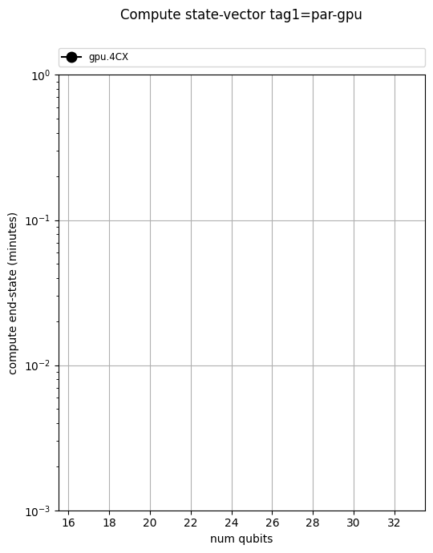
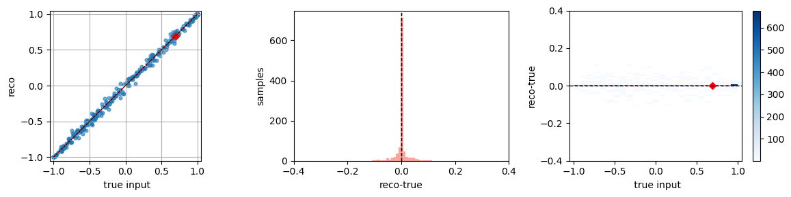
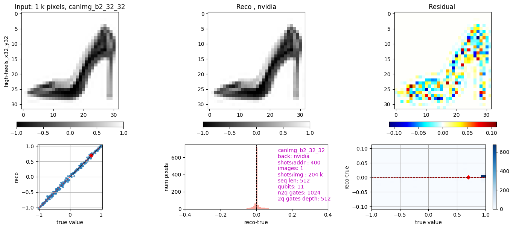
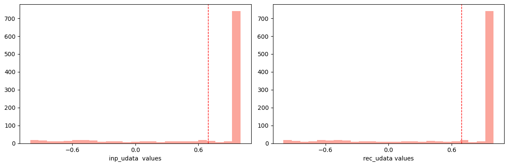

<!-- WARNING: THIS FILE WAS AUTOGENERATED! DO NOT EDIT! -->

``` python
generate_random_gateList(3, 1, 1)
```

    ({'circ_type': array([[3, 3]], dtype=int32),
      'gate_type': array([[[2, 2, 1],
              [3, 1, 2],
              [4, 2, 1]]], dtype=int32),
      'gate_param': array([[0.00939151, 0.4153083 , 0.        ]], dtype=float32)},
     {'gate_map': {'h': 1, 'ry': 2, 'rz': 3, 'cx': 4, 'measure': 5},
      'num_cx': 1,
      'num_qubit': 3,
      'num_gate': 3,
      'num_circ': 1})

``` python
generate_random()
```

    saving data as hdf5: /pscratch/sd/g/gzquse/qgear/nbs/circ/rcirc_68b01a.gate_list.h5
    h5-write : circ_type (1, 2) int32
    h5-write : gate_type (1, 12, 3) int32
    h5-write : gate_param (1, 12) float32
    h5-write : meta.JSON as string (1,) object
    closed  hdf5: /pscratch/sd/g/gzquse/qgear/nbs/circ/rcirc_68b01a.gate_list.h5  size=0.01 MB, elaT=0.0 sec
    {'gate_map': {'cx': 4, 'h': 1, 'measure': 5, 'ry': 2, 'rz': 3},
     'hash': '68b01a',
     'num_circ': 1,
     'num_cx': 4,
     'num_gate': 12,
     'num_qubit': 5,
     'short_name': 'rcirc_68b01a'}

    '/pscratch/sd/g/gzquse/qgear/nbs/circ/rcirc_68b01a.gate_list.h5'

``` python
from qgear.runner import run_gate_job
run_gate_job(
    exp="rcirc_0a89fd",
    backend="nvidia",
    numshots=1000
)
```

    read data from hdf5: /pscratch/sd/g/gzquse/qgear/nbs/circ/rcirc_0a89fd.gate_list.h5
    read obj: circ_type (1, 2) int32
    read obj: gate_param (1, 12) float32
    read obj: gate_type (1, 12, 3) int32
    read str: meta.JSON 1 <class 'numpy.ndarray'>
     done h5, num rec:3  elaT=0.0 sec
      closed  yaml: /pscratch/sd/g/gzquse/qgear/nbs/meas/rcirc_0a89fd_adj-gpu_fp32.yaml  size=0.3 kB   elaT=0.0 sec
    M:done rcirc_0a89fd elaT=1755839349.2 sec
    {'date': '20250821_220909_PDT',
     'elapsed_time': 1755839349.2274594,
     'gate_map': {'cx': 4, 'h': 1, 'measure': 5, 'ry': 2, 'rz': 3},
     'hash': '0a89fd',
     'num_circ': 1,
     'num_cx': 4,
     'num_gate': 12,
     'num_meas_strings': [4],
     'num_qpus': 1,
     'num_qubit': 5,
     'num_shots': 1000,
     'short_name': 'rcirc_0a89fd',
     'target': 'nvidia',
     'target2': 'adj-gpu'}

    {'gate_map': {'h': 1, 'ry': 2, 'rz': 3, 'cx': 4, 'measure': 5},
     'num_cx': 4,
     'num_qubit': 5,
     'num_gate': 12,
     'num_circ': 1,
     'hash': '0a89fd',
     'short_name': 'rcirc_0a89fd',
     'num_qpus': 1,
     'elapsed_time': 1755839349.2274594,
     'target': 'nvidia',
     'date': '20250821_220909_PDT',
     'num_meas_strings': [4],
     'target2': 'adj-gpu',
     'num_shots': 1000}

``` python
from qgear.metrics_plotter import metrics_plot

# Only specify the date folder(s)
metrics_plot()
```

      read  yaml: /pscratch/sd/g/gzquse/qgear/nbs/meas/rcirc_0a89fd_adj-gpu_fp32.yaml
    PlotterBackbone: Running in Jupyter → using inline backend
    MetricsPlotter : Graphics started
    Graphics saving to  out/metrics_f2.png



``` python
from qgear.image import create_img
from qgear.runner import run_qcrank
from qgear.plotter import process_qcrank_experiment

# Step 1: Create input
create_img(tag="b2", inp_path=None, out_path="out")

# Step 2: Run simulation
run_qcrank("canImg_b2_32_32", inp_path="out", out_path="out", exp_name="canImg_b2_32_32")

# Step 3: Post-process and plot
process_qcrank_experiment("canImg_b2_32_32", inp_path="out", out_path="out", show_plots="abc")
```

    Loading built-in image 'high-heels_x32_y32.png' from qgear/data/
    Metadata: {'image_name': 'high-heels_x32_y32', 'image_shape_xy': [32, 32], 'image_pixels': 1024, 'canned_type': 'gray_image'}
    Normalized image min/max: -1.0, 1.0
    Flattened image shape: (1024,), reshaped: (2, 512)
    saving data as hdf5: out/canImg_b2_32_32.qcrank_inp.h5
    h5-write : phys_image (32, 32) uint8
    h5-write : image_name as string (1,) object
    h5-write : norm_image (32, 32) float32
    h5-write : inp_udata (1, 2, 512) float32
    h5-write : inp_fdata (512, 2, 1) float32
    h5-write : meta.JSON as string (1,) object
    closed  hdf5: out/canImg_b2_32_32.qcrank_inp.h5  size=0.02 MB, elaT=0.0 sec
    Saved QCrank input: out/canImg_b2_32_32.qcrank_inp.h5
    read data from hdf5: out/canImg_b2_32_32.qcrank_inp.h5
    read str: image_name 1 <class 'numpy.ndarray'>
    read obj: inp_fdata (512, 2, 1) float32
    read obj: inp_udata (1, 2, 512) float32
    read str: meta.JSON 1 <class 'numpy.ndarray'>
    read obj: norm_image (32, 32) float32
    read obj: phys_image (32, 32) uint8
     done h5, num rec:5  elaT=0.0 sec
    {'canned': {'canned_type': 'gray_image',
                'image_name': 'high-heels_x32_y32',
                'image_pixels': 1024,
                'image_shape_xy': [32, 32]},
     'payload': {'nq_addr': 9,
                 'nq_fdata': 2,
                 'num_clbit': 11,
                 'num_sample': 1,
                 'qcrank_max_fval': 3.141592653589793,
                 'seq_len': 512},
     'short_name': 'canImg_b2_32_32',
     'submit': {'num_shots': 204800}}
    M: using backend=nvidia, total shots=204800
    M: circuit has 11 qubits
    circ_orig depth_aziz: {'cx': 512, '2q': 512, '3q': 0, '4q+': 2, '1q': 514} , ops: {'ry': 1024, 'cx': 1024, 'measure': 11, 'h': 9, 'barrier': 2, 'qubits': 11}
    circ_transpMeta:
    {'1q_gate_count': 1033,
     '2q_gate_count': 1024,
     '2q_gate_depth': 512,
     'num_qubit': 11,
     'phys_qubits': [0, 1, 2, 3, 4, 5, 6, 7, 8, 9, 10],
     'transpile_backend': 'nvidia'}

    /pscratch/sd/g/gzquse/qgear/lib/python3.11/site-packages/qiskit/compiler/transpiler.py:269: UserWarning: Providing `coupling_map` and/or `basis_gates` along with `backend` is not recommended, as this will invalidate the backend's gate durations and error rates.
      pm = generate_preset_pass_manager(

    M: execution-ready 1 circuits on 11 qubits on nvidia
    qiskit_to_gateList: nGate 2070
    saving data as hdf5: out/canImg_b2_32_32.gate_list.h5
    h5-write : circ_type (1, 2) int32
    h5-write : gate_type (1, 2070, 3) int32
    h5-write : gate_param (1, 2070) float32
    h5-write : meta.JSON as string (1,) object
    closed  hdf5: out/canImg_b2_32_32.gate_list.h5  size=0.04 MB, elaT=0.0 sec
    read data from hdf5: out/canImg_b2_32_32.gate_list.h5
    read obj: circ_type (1, 2) int32
    read obj: gate_param (1, 2070) float32
    read obj: gate_type (1, 2070, 3) int32
    read str: meta.JSON 1 <class 'numpy.ndarray'>
     done h5, num rec:3  elaT=0.0 sec
    M: job canImg_b2_32_32 started, nCirc=1, nq=11, shots/circ=400, target=nvidia
    RCQ: done 907 nvidia, elapsed 1.07s
    Job QA: {'status': 'JobStatus.DONE', 'num_circ': 1, 'num_clbits': 11, 'device': 'GPU', 'method': 'statevector', 'noise': 'ideal', 'shots': 204800, 'time_taken': 1.0713422298431396}
    saving data as hdf5: out/canImg_b2_32_32.h5
    h5-write : image_name (1,) object
    h5-write : inp_fdata (512, 2, 1) float32
    h5-write : inp_udata (1, 2, 512) float32
    h5-write : norm_image (32, 32) float32
    h5-write : phys_image (32, 32) uint8
    h5-write : raw_nkey (1,) int32
    h5-write : raw_ikey (1, 907) int32
    h5-write : raw_mshot (1, 907) int32
    h5-write : meta.JSON as string (1,) object
    closed  hdf5: out/canImg_b2_32_32.h5  size=0.03 MB, elaT=0.0 sec
    read data from hdf5: out/canImg_b2_32_32.h5
    read str: image_name 1 <class 'numpy.ndarray'>
    read obj: inp_fdata (512, 2, 1) float32
    read obj: inp_udata (1, 2, 512) float32
    read str: meta.JSON 1 <class 'numpy.ndarray'>
    read obj: norm_image (32, 32) float32
    read obj: phys_image (32, 32) uint8
    read obj: raw_ikey (1, 907) int32
    read obj: raw_mshot (1, 907) int32
    read obj: raw_nkey (1,) int32
     done h5, num rec:8  elaT=0.0 sec
    rec_udata: (1, 2, 512) addrBitsL: [2, 3, 4, 5, 6, 7, 8, 9, 10]
    ic=0 marginal ibit=0 done, elaT=0.0 min
    ic=0 marginal ibit=1 done, elaT=0.0 min
    saving data as hdf5: out/canImg_b2_32_32.post.h5
    h5-write : image_name (1,) object
    h5-write : inp_fdata (512, 2, 1) float32
    h5-write : inp_udata (1, 2, 512) float32
    h5-write : norm_image (32, 32) float32
    h5-write : phys_image (32, 32) uint8
    h5-write : raw_ikey (1, 907) int32
    h5-write : raw_mshot (1, 907) int32
    h5-write : raw_nkey (1,) int32
    h5-write : rec_udata (1, 2, 512) float64
    h5-write : rec_norm_image (32, 32) float64
    h5-write : meta.JSON as string (1,) object
    closed  hdf5: out/canImg_b2_32_32.post.h5  size=0.05 MB, elaT=0.0 sec
    PlotterBackbone: Running in Jupyter → using inline backend
    Plotter : Graphics started
    plotted  high-heels_x32_y32
    Graphics saving to  out/canImg_b2_32_32_f1.png
    Graphics saving to  out/canImg_b2_32_32_f2.png
    Graphics saving to  out/canImg_b2_32_32_f3.png







    ({'image_name': array([b'high-heels_x32_y32'], dtype=object),
      'inp_fdata': array([[[0.   ],
              [0.   ]],
      
             [[0.   ],
              [0.   ]],
      
             [[0.   ],
              [0.   ]],
      
             ...,
      
             [[0.   ],
              [2.11 ]],
      
             [[0.   ],
              [0.857]],
      
             [[0.   ],
              [0.   ]]], shape=(512, 2, 1), dtype=float32),
      'inp_udata': array([[[ 1.   ,  1.   ,  1.   , ..., -0.514,  0.655,  1.   ],
              [ 1.   ,  1.   ,  1.   , ...,  1.   ,  1.   ,  1.   ]]],
            shape=(1, 2, 512), dtype=float32),
      'norm_image': array([[1.   , 1.   , 1.   , ..., 1.   , 1.   , 1.   ],
             [1.   , 1.   , 1.   , ..., 1.   , 1.   , 1.   ],
             [1.   , 1.   , 1.   , ..., 1.   , 1.   , 1.   ],
             ...,
             [1.   , 1.   , 0.953, ..., 1.   , 1.   , 1.   ],
             [1.   , 1.   , 1.   , ..., 0.992, 1.   , 1.   ],
             [1.   , 1.   , 1.   , ..., 1.   , 1.   , 1.   ]],
            shape=(32, 32), dtype=float32),
      'phys_image': array([[255, 255, 255, ..., 255, 255, 255],
             [255, 255, 255, ..., 255, 255, 255],
             [255, 255, 255, ..., 255, 255, 255],
             ...,
             [255, 255, 249, ..., 255, 255, 255],
             [255, 255, 255, ..., 254, 255, 255],
             [255, 255, 255, ..., 255, 255, 255]], shape=(32, 32), dtype=uint8),
      'raw_ikey': array([[ 432, 1800,  492,  160,  904,  760,  364, 1540, 1536, 1932,   52,
              1488, 1976,  528, 1844, 1992, 1972,  644, 1940, 1936,  908,  504,
              1612,   60, 1968,  700,  252,   64,  672,  784, 1864, 1808, 1684,
               688,    8,  920,  168,  664,  324, 1956,   40,  484, 1364,  428,
               232,  772, 1740,  796,  536, 1848, 1704,  792,  248,  556,  466,
              2009, 1408,  304, 1928,  732, 1788,  152,  356, 1548, 1334,  272,
               520, 1832, 1964,  412,  896, 1616,  552,  196, 1218,  718,  516,
               128, 1984,  488, 1816, 1152,  276, 1692,  544,   48, 1980, 1222,
               512, 1412,   12, 1836,   28,  264, 1672,   68,  292,  740, 1812,
               684,  768, 1856, 1840, 1544,  296, 1028, 1236,  352,  392, 1668,
               164,  376, 1708, 1645,  448,  338, 1112,  184, 1868, 1680, 1944,
               900, 1860, 1094,  342, 1280,  640,  320,  912, 1960,  312, 1156,
               660,  524,  892, 1889,  776,  420, 1330, 1226,  416,  680,  308,
               436,  780,  136,  280,  856, 1284,  172, 1916, 1641,  256, 1952,
              1700,  846,  576,  984, 1732, 1116, 1404, 1765,   20, 1804, 1820,
              1852,  192, 1712,  540,  988,  384,  648,  408,   56,  388, 1988,
               148, 1036,  124, 1276, 1920, 1240,  260,  532, 1716,  284,   16,
               916,  188, 1020,  288,  800,  864, 1736,  104,  440,  604,  636,
               144, 1720,  404,  180,  652,  444, 1326,  560,  176,  804,  140,
              1098, 1350, 1792,  632,    4,  300,   24, 1338,  214,    0,   32,
               120, 1696, 1828,  676,  612,  108, 1724,  736, 1016, 1796,   86,
              1470, 2013,   36,  396,  860, 1532,   90,  424, 1148, 1346,  400,
               360,  132,  268,   44,  594,  480, 1872,  156,  568,  696, 1492,
              1058, 1202, 1322, 1924,  236, 1664,  692, 1660,  764,  608,  564,
              1505, 1688,  788, 1342, 1261, 1824,  452,  316, 1556, 1676, 1948,
               656,  888,   76, 1206, 1552, 1032,  970,  228,  572,  508, 1474,
              1024,  668, 2044,  380, 1728,  240,   72,  548, 1054, 1466, 1381,
               200, 1608,  584,  328,  580, 1462, 1001, 2000,  812,  590,  868,
               218, 1214, 1761,  960,  616, 1478, 1062, 1198, 1885,  992, 1253,
              1040,  873, 1160,  456,  496,  820,  924, 1210,  708, 1354, 1517,
               816,  808, 1416, 1633, 1881, 1744,  824, 1458,  842, 1996, 1257,
              1637,  704, 1450, 1454,  956, 1769, 1389,  112, 1620,  332, 1482,
               974, 1529, 1108, 1358, 1129,  204, 1564,  836, 1005,  722, 2028,
               828, 1446, 1368, 1244, 1318, 1773, 1757,  368, 2040,  474, 1438,
              1560,  728, 1442, 1102, 1901,  476, 1905, 1509, 1133,  978, 1050,
              1377,  620, 1230, 1294, 1748, 1781, 1657, 1420, 1893, 1360, 1120,
               832, 1170,  100, 1912, 1314,   98, 1598, 1106, 1897,  470,  222,
              2017,  948, 1484,   94, 1629, 1372, 1174,  944, 2037,  726, 1513,
              1401, 1909, 1084, 1434, 1496,  624, 1298,  850,  346, 1385, 1568,
              1876, 2021, 1306, 1602,  598,  118, 1624, 1777, 1430,  934,  749,
              2005, 1310, 1125,  224, 1144,  246,  756, 1080, 1273, 1076, 1302,
               940, 1234,  938, 1649,  854, 1066,  980,  210,  966,  952,   80,
              1582, 1290,  712, 1164,  997,  628, 1178,  374, 1184, 1068, 1572,
               602,  350, 1594, 1249, 1424,  928, 1072, 1653,  502, 1586, 1590,
              1576, 1090,  877, 1604, 2024, 2032, 1194,  881, 1784,  500, 1166,
              1192, 1188, 1013,  600,  758,  744,  460, 1580, 1752, 1500,  630,
               745,  996, 1180, 1141, 1426,  462, 1248, 1753, 1044, 1136,  852,
               372,  884, 1186,  876, 1606, 1182, 1304,  964, 1501,  208, 1064,
              1578, 1074, 1521,  348, 1596, 1046, 1785, 1584, 1088, 1232, 1070,
              1145, 2033,  752, 1592, 1300,  714, 1393, 1078, 1600, 1588,  930,
               942, 1574, 1190, 1176, 1269, 1265, 2025, 1625,  936,  244, 1008,
              1288, 1308, 1877, 1264,  621, 1272,  748, 1082,  982, 2004,  226,
              1913, 1422, 1172, 1428,  946,  724, 1137, 1396, 1124, 1015, 1896,
              1268,  869, 1296,  472, 1009,  958, 1168, 1392, 1312,  950, 1656,
              1524, 1486,  753, 1776,  344,  848,  954, 1121, 1904, 1570, 1373,
               932,  116,  626, 1648,  886, 1086, 1528,  596, 1652, 1436, 1397,
              1143, 1048, 1292, 1525, 1520, 2020,  220,  498,   96, 1104,   92,
              2016, 1512, 1780, 2001, 1432,   82,  102,  468, 1908,  834, 1400,
              1362, 1772, 1376, 1900, 1566,  830, 1628, 1060, 1497, 1749, 1004,
               880, 1892,  976, 2036, 1440, 1128, 1636, 1356,  370,  582, 1880,
              1621, 1384, 1196, 1245, 1508, 2029, 1480,  216, 1256, 1444,  720,
              1523, 1456, 1000, 1452, 1394, 1208,  334,  885, 1316, 1228,  730,
              1398,  478,  840, 1132, 1271, 1100,  330,  883, 1527, 1768, 1388,
               242, 1418,  814, 1042, 1526, 1448, 1212,  706, 1610, 1204,  838,
              1252, 1012,  962, 1266,  754,  826, 1140,  586, 1873, 1399, 1395,
              1138, 1010,  810, 1110,  206, 1200,  972, 1756,  458,  710, 1270,
              1522, 1369, 2041, 1632,  872, 1562, 1267,  887, 1162,   78, 1655,
              1260, 1516,  818,  114,  454, 1052,  926,  822, 1139, 1651, 1011,
              1760, 1476,  340,  588,  617, 1352, 1460,  202, 1997,  755, 1320,
               882, 1464, 1014,   84, 1558, 1142, 1726, 1504, 1324, 1380, 1745,
              1056, 1884, 1472, 1730,  122,  993, 1654, 1493, 1017,  592,  336,
              1640, 2012, 1286, 1328, 1650, 1682, 1888, 1468, 1117, 1224, 1722,
              1718, 1678,   88,  234, 2008,  844, 1826,   74,  362,  490,  790,
               894, 1534, 1764,  562,  358,  670,  761, 1348, 1332,  618,  858,
               250, 1734, 1686, 1494, 1406, 1278, 1869, 1533, 1259, 1515, 1096,
               674,  610,  738, 1618, 1714, 1674, 1866,  554, 1834, 1242,  486,
               566,  558,  638,  766, 1022, 1737,  365, 1131, 1092, 1154, 1386,
              1414,  326, 1830, 1838, 1822,  990, 1150,  737, 1989, 1109, 1405,
               893, 1643, 1387,  747,  786, 1842,  746, 1514,  794, 1370, 1742,
               238, 1118, 1982, 1662,  382,  361, 1241, 1237,  861,  733, 1911,
              1644,  322,  194,  906, 1130, 1642, 1818,  570, 1862,  678, 1814,
              1238, 1910,  862,  574,  510,  609, 1617, 1361,  985,  629, 1613,
              1485, 1021, 1907,  875, 1003]], dtype=int32),
      'raw_mshot': array([[453, 453, 449, 448, 447, 444, 444, 441, 439, 439, 438, 436, 435,
              434, 432, 431, 430, 429, 429, 428, 428, 427, 427, 427, 426, 426,
              426, 425, 425, 425, 425, 424, 424, 423, 423, 423, 422, 422, 422,
              422, 421, 421, 421, 421, 420, 420, 420, 420, 419, 419, 418, 418,
              418, 418, 418, 418, 417, 417, 417, 417, 417, 416, 416, 416, 416,
              415, 415, 415, 415, 415, 414, 414, 414, 414, 414, 414, 413, 412,
              412, 412, 412, 410, 410, 410, 409, 409, 409, 409, 408, 408, 407,
              407, 407, 406, 406, 406, 406, 406, 406, 406, 405, 405, 405, 405,
              405, 405, 405, 404, 404, 404, 404, 403, 403, 403, 402, 402, 401,
              401, 401, 400, 400, 400, 400, 400, 400, 399, 399, 399, 399, 399,
              399, 399, 399, 399, 399, 399, 398, 398, 398, 398, 397, 397, 397,
              397, 397, 396, 396, 396, 396, 396, 396, 396, 395, 395, 395, 395,
              394, 394, 394, 394, 394, 394, 393, 393, 393, 393, 392, 392, 392,
              391, 390, 390, 390, 390, 390, 390, 390, 390, 390, 390, 389, 389,
              389, 389, 389, 389, 388, 388, 388, 388, 387, 387, 387, 387, 387,
              387, 387, 387, 386, 386, 386, 386, 386, 386, 386, 385, 385, 385,
              385, 385, 385, 384, 384, 384, 384, 383, 383, 383, 382, 382, 382,
              381, 381, 381, 381, 381, 381, 380, 380, 380, 380, 380, 380, 379,
              379, 379, 379, 379, 378, 378, 378, 377, 377, 377, 377, 377, 377,
              376, 376, 376, 375, 375, 375, 375, 375, 375, 374, 374, 373, 373,
              373, 373, 371, 371, 369, 368, 368, 368, 368, 367, 367, 367, 366,
              366, 366, 365, 365, 365, 365, 364, 364, 364, 363, 363, 363, 363,
              362, 361, 361, 358, 357, 357, 357, 357, 357, 356, 355, 353, 352,
              351, 349, 346, 346, 346, 345, 345, 345, 343, 343, 342, 342, 341,
              341, 341, 341, 341, 341, 340, 340, 339, 339, 338, 338, 337, 337,
              337, 336, 335, 335, 335, 334, 334, 333, 333, 332, 331, 331, 331,
              331, 330, 329, 329, 328, 328, 328, 327, 327, 327, 326, 326, 326,
              326, 326, 326, 325, 324, 323, 322, 322, 319, 319, 317, 316, 316,
              316, 314, 314, 314, 314, 314, 313, 313, 313, 313, 312, 312, 310,
              309, 309, 308, 306, 306, 306, 305, 305, 302, 301, 301, 300, 299,
              298, 297, 296, 296, 295, 292, 291, 291, 290, 289, 289, 289, 289,
              288, 288, 286, 285, 285, 284, 284, 284, 284, 283, 283, 282, 281,
              279, 278, 278, 278, 277, 277, 275, 274, 274, 274, 273, 271, 270,
              270, 270, 269, 268, 268, 268, 267, 267, 266, 264, 263, 262, 261,
              261, 258, 258, 257, 256, 254, 254, 253, 253, 252, 251, 249, 249,
              248, 245, 244, 244, 243, 242, 240, 238, 237, 236, 235, 234, 233,
              233, 233, 232, 232, 231, 229, 229, 228, 227, 226, 225, 225, 224,
              222, 220, 219, 218, 218, 216, 214, 212, 209, 209, 203, 201, 200,
              198, 195, 195, 195, 194, 194, 192, 191, 191, 190, 189, 189, 189,
              188, 188, 187, 184, 183, 181, 180, 179, 177, 177, 177, 177, 177,
              176, 176, 175, 174, 174, 174, 173, 173, 173, 172, 172, 171, 171,
              169, 168, 166, 165, 163, 163, 163, 161, 158, 158, 157, 157, 157,
              156, 155, 155, 154, 154, 152, 152, 151, 149, 148, 148, 148, 147,
              147, 142, 142, 142, 142, 141, 141, 140, 140, 140, 140, 139, 138,
              137, 136, 134, 133, 133, 131, 130, 129, 127, 127, 126, 124, 124,
              123, 122, 122, 121, 120, 120, 119, 119, 118, 118, 117, 117, 116,
              116, 115, 115, 115, 114, 112, 112, 111, 111, 111, 110, 110, 110,
              109, 109, 109, 109, 109, 108, 106, 106, 106, 105, 105, 105, 105,
              104, 104, 104, 103, 103, 103, 103, 102, 102, 102, 100,  99,  99,
               98,  98,  97,  96,  96,  96,  96,  95,  94,  94,  93,  92,  91,
               91,  89,  88,  86,  86,  86,  86,  86,  85,  84,  84,  83,  82,
               82,  81,  81,  78,  78,  77,  77,  76,  75,  74,  74,  73,  73,
               72,  72,  72,  71,  71,  71,  71,  71,  70,  70,  70,  69,  69,
               69,  69,  67,  67,  67,  67,  67,  66,  66,  65,  65,  65,  63,
               62,  62,  61,  61,  61,  61,  61,  61,  60,  60,  60,  60,  59,
               58,  58,  58,  58,  57,  56,  56,  56,  56,  56,  56,  54,  54,
               54,  53,  53,  53,  53,  53,  52,  52,  52,  51,  51,  50,  50,
               47,  46,  45,  44,  44,  44,  44,  43,  42,  42,  42,  41,  39,
               39,  39,  39,  39,  38,  37,  32,  32,  31,  31,  31,  31,  30,
               30,  29,  29,  28,  27,  26,  26,  26,  26,  25,  25,  24,  23,
               23,  23,  23,  23,  22,  22,  21,  17,  17,  17,  16,  15,  14,
               14,  13,  10,   9,   7,   7,   7,   7,   7,   7,   7,   7,   6,
                6,   6,   6,   6,   5,   5,   5,   5,   5,   5,   5,   5,   5,
                5,   5,   5,   5,   5,   4,   4,   4,   4,   4,   4,   4,   4,
                4,   4,   4,   4,   4,   4,   4,   4,   4,   4,   4,   4,   3,
                3,   3,   3,   3,   3,   3,   3,   3,   3,   3,   3,   3,   3,
                3,   3,   3,   3,   2,   2,   2,   2,   2,   2,   2,   2,   2,
                2,   2,   2,   2,   2,   2,   2,   2,   2,   1,   1,   1,   1,
                1,   1,   1,   1,   1,   1,   1,   1,   1,   1,   1,   1,   1,
                1,   1,   1,   1,   1,   1,   1,   1,   1,   1]], dtype=int32),
      'raw_nkey': array([907], dtype=int32),
      'rec_udata': array([[[ 1.   ,  1.   ,  1.   , ..., -0.523,  0.706,  1.   ],
              [ 1.   ,  1.   ,  1.   , ...,  1.   ,  1.   ,  1.   ]]],
            shape=(1, 2, 512)),
      'rec_norm_image': array([[1.   , 1.   , 1.   , ..., 1.   , 1.   , 1.   ],
             [1.   , 1.   , 1.   , ..., 1.   , 1.   , 1.   ],
             [1.   , 1.   , 1.   , ..., 1.   , 1.   , 1.   ],
             ...,
             [1.   , 1.   , 0.98 , ..., 1.   , 1.   , 1.   ],
             [1.   , 1.   , 1.   , ..., 0.984, 1.   , 1.   ],
             [1.   , 1.   , 1.   , ..., 1.   , 1.   , 1.   ]], shape=(32, 32)),
      'meta.JSON': '{"payload": {"num_sample": 1, "nq_addr": 9, "seq_len": 512, "nq_fdata": 2, "num_clbit": 11, "qcrank_max_fval": 3.141592653589793, "num_qubit": 11}, "canned": {"image_name": "high-heels_x32_y32", "image_shape_xy": [32, 32], "image_pixels": 1024, "canned_type": "gray_image"}, "short_name": "canImg_b2_32_32", "submit": {"num_shots": 204800, "backend": "nvidia", "date": "20250821_220911_PDT", "unix_time": 1755839351}, "transpile": {"num_qubit": 11, "phys_qubits": [0, 1, 2, 3, 4, 5, 6, 7, 8, 9, 10], "transpile_backend": "nvidia", "2q_gate_depth": 512, "1q_gate_count": 1033, "2q_gate_count": 1024}, "hash": "133681", "job_qa": {"status": "JobStatus.DONE", "num_circ": 1, "num_clbits": 11, "device": "GPU", "method": "statevector", "noise": "ideal", "shots": 204800, "time_taken": 1.0713422298431396}}'},
     {'payload': {'num_sample': 1,
       'nq_addr': 9,
       'seq_len': 512,
       'nq_fdata': 2,
       'num_clbit': 11,
       'qcrank_max_fval': 3.141592653589793,
       'num_qubit': 11},
      'canned': {'image_name': 'high-heels_x32_y32',
       'image_shape_xy': [32, 32],
       'image_pixels': 1024,
       'canned_type': 'gray_image'},
      'short_name': 'canImg_b2_32_32',
      'submit': {'num_shots': 204800,
       'backend': 'nvidia',
       'date': '20250821_220911_PDT',
       'unix_time': 1755839351},
      'transpile': {'num_qubit': 11,
       'phys_qubits': [0, 1, 2, 3, 4, 5, 6, 7, 8, 9, 10],
       'transpile_backend': 'nvidia',
       '2q_gate_depth': 512,
       '1q_gate_count': 1033,
       '2q_gate_count': 1024},
      'hash': '133681',
      'job_qa': {'status': 'JobStatus.DONE',
       'num_circ': 1,
       'num_clbits': 11,
       'device': 'GPU',
       'method': 'statevector',
       'noise': 'ideal',
       'shots': 204800,
       'time_taken': 1.0713422298431396},
      'plot': {'resid_max_range': 0.4}})
