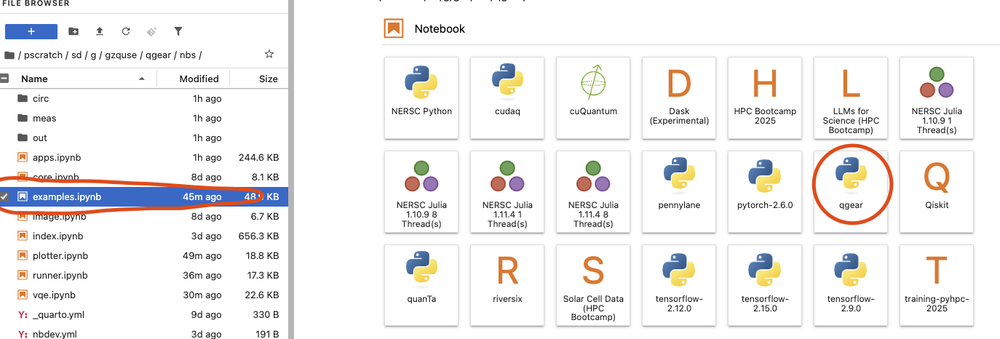
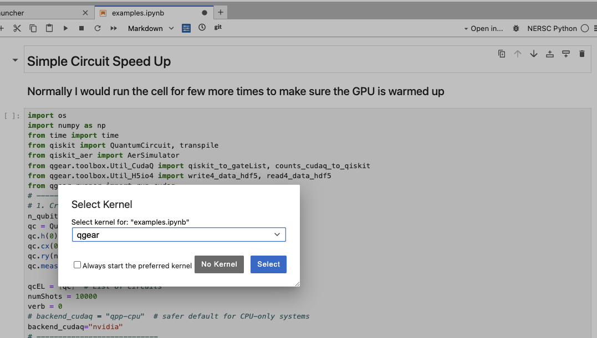

# qgear


<!-- WARNING: THIS FILE WAS AUTOGENERATED! DO NOT EDIT! -->

> paper link: https://arxiv.org/pdf/2504.03967

<figure>

<figcaption aria-hidden="true">image.png</figcaption>
</figure>

## Preliminary

- Let’s assume you already have a computational GPU node allocated on
  HPC
- Checking the NVIDIA GPU
  - `nvidia-smi`
- Create a env (we do not recommend using default such .local / HOME)
- Note that more than one GPU support need to enable
  [MPI](https://nvidia.github.io/cuda-quantum/latest/using/quick_start.html#install-cuda-q)
  \> the way we choose is high performance lustre file system

## 1. Install ENV

clone repo

``` bash
git clone git@github.com:gzquse/qgear.git`

cd qgear
```

``` bash
module load conda
conda create --prefix=/pscratch/sd/{location}/{username}/qgear -y python=3.11 pip
conda activate $SCRATCH/qgear
```

``` bash
pip install -u qgear 
pip install -u ipykernel
python -m ipykernel install --user --name qgear --display-name qgear
```

test qgear install successfully

``` bash
qgear
```

<p align="center">

<pre>
   ___     ____ _____    _    ____                                                      
  / _ \   / ___| ____|  / \  |  _ \                                                     
 | | | | | |  _|  _|   / _ \ | |_) |                                                    
 | |_| | | |_| | |___ / ___ \|  _ <                                                     
  \__\_\  \____|_____/_/   \_\_| \_\                                                    
&#10;
Installation successful!
&#10;Welcome to QGEAR. Run 'qgear.run_cudaq()' to speed up.
Fun fact: We love to use Emacs! 🐧
</pre>

</p>

## 2. Open Jupyter Notebook

### NERSC jupyter

https://jupyter.nersc.gov/

Select the kernel


go to nbs/example.ipynb; run example


### Pypi

https://pypi.org/project/qgear/

### Demos

#### 1. simple speed up with random circuit and QFT

https://gzquse.github.io/qgear/examples.html

#### 2. quantum image encoding

> see appendix F in the paper https://gzquse.github.io/qgear/apps.html

<figure>

<figcaption aria-hidden="true">image.png</figcaption>
</figure>

## local development

``` sh
. ./pm_martin.dev.source

# make sure qgear package is installed in development mode
https://nbdev.fast.ai/tutorials/tutorial.html
pip3 install -e '.[dev]'
pip3 install qgear

# compile to have changes apply to qgear
nbdev_prepare
```

### Supported Quantum Gates

This is the list of quantum gates currently supported by the
implementation, based on the `gateId` mapping.

<table>
<colgroup>
<col style="width: 4%" />
<col style="width: 8%" />
<col style="width: 36%" />
<col style="width: 43%" />
<col style="width: 7%" />
</colgroup>
<thead>
<tr>
<th>Gate ID</th>
<th>Gate Name</th>
<th>Description</th>
<th>Parameters</th>
<th>Example Usage</th>
</tr>
</thead>
<tbody>
<tr>
<td><strong>1</strong></td>
<td><strong>H</strong> (Hadamard)</td>
<td>Creates superposition by mapping (</td>
<td>0) and (</td>
<td>1).</td>
</tr>
<tr>
<td><strong>2</strong></td>
<td><strong>RY</strong> rotation</td>
<td>Rotation around the Y-axis by a given angle.</td>
<td><code>angle</code> (in radians), target qubit <code>q0</code></td>
<td><code>ry(angles[j], q0)</code></td>
</tr>
<tr>
<td><strong>3</strong></td>
<td><strong>RZ</strong> rotation</td>
<td>Rotation around the Z-axis by a given angle.</td>
<td><code>angle</code> (in radians), target qubit <code>q0</code></td>
<td><code>rz(angles[j], q0)</code></td>
</tr>
<tr>
<td><strong>4</strong></td>
<td><strong>CX</strong> (CNOT)</td>
<td>Controlled-X gate; flips target qubit if control qubit is (</td>
<td>1).</td>
<td>Control qubit <code>q0</code>, target qubit <code>q1</code></td>
</tr>
<tr>
<td><strong>5</strong></td>
<td><strong>Measure</strong></td>
<td>Measures the qubit in the computational basis.</td>
<td>Target qubit <code>q0</code></td>
<td><code>mz(q0)</code> <em>(example)</em></td>
</tr>
<tr>
<td><strong>6</strong></td>
<td><strong>CP</strong> (Controlled-Phase)</td>
<td>Applies a phase shift to the target qubit if control qubit is (</td>
<td>1).</td>
<td><code>angle</code> (phase in radians), control qubit
<code>q0</code>, target qubit <code>q1</code></td>
</tr>
<tr>
<td><strong>7</strong></td>
<td><strong>SWAP</strong></td>
<td>Swaps the quantum states of two qubits.</td>
<td>Qubit <code>q0</code>, qubit <code>q1</code></td>
<td><code>swap(q0, q1)</code></td>
</tr>
<tr>
<td><strong>8</strong></td>
<td><strong>U</strong> (U3 gate)</td>
<td>General single-qubit rotation parameterized by three Euler
angles.</td>
<td><code>theta</code>, <code>phi</code>, <code>lambda_</code> (all in
radians), target qubit <code>q0</code></td>
<td><code>u3(theta, phi, lambda_, q0)</code></td>
</tr>
</tbody>
</table>

------------------------------------------------------------------------

## Notes

- `q0` is the **primary target qubit**.
- `q1` is an **additional target or control qubit** (depending on the
  gate).
- `angles` is an array of rotation parameters in **radians**.
- `gate_type` and `qvector` are used to determine qubit mapping for
  multi-qubit gates.
- The **U3 gate** is the most general single-qubit gate and can
  represent any rotation.

------------------------------------------------------------------------

## Example Gate Sequence

\`\`\`python \# Apply Hadamard to qubit 0 h(q0)

# Rotate qubit 0 around Y-axis by pi/4

ry(math.pi/4, q0)

# Apply CNOT from qubit 0 to qubit 1

x.ctrl(q0, q1)

# Apply a controlled-phase gate

r1.ctrl(math.pi/2, q0, q1)

# Swap qubits 0 and 1

swap(q0, q1)

# Apply a general U3 rotation

u3(theta, phi, lambda\_, q0)

### Goal

build the versatile all-in-one quantum accelerator for HPC-QPU hybrid
regime that supports all the mainstream quantum frameworks.
