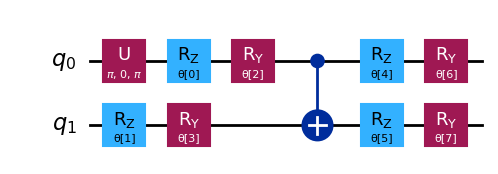

<!-- WARNING: THIS FILE WAS AUTOGENERATED! DO NOT EDIT! -->

We want to use a variational algorithm to find the eigenvalues of the
observable:

*Ô*<sub>1</sub> = 2*I**I* − 2*X**X* + 3*Y**Y* − 3*Z**Z*

### Eigenvalues

*λ*<sub>0</sub> = −6,  *λ*<sub>1</sub> = 4,  *λ*<sub>2</sub> = 4,  *λ*<sub>3</sub> = 6

### Eigenstates

$$
\begin{aligned}
|\phi_0\rangle &= \frac{1}{\sqrt{2}} (|00\rangle + |11\rangle) \\
|\phi_1\rangle &= \frac{1}{\sqrt{2}} (|00\rangle - |11\rangle) \\
|\phi_2\rangle &= \frac{1}{\sqrt{2}} (|01\rangle - |10\rangle) \\
|\phi_3\rangle &= \frac{1}{\sqrt{2}} (|01\rangle + |10\rangle)
\end{aligned}
$$

``` python
from qiskit.quantum_info import SparsePauliOp
 
observable_1 = SparsePauliOp.from_list([("II", 2), ("XX", -2), ("YY", 3), ("ZZ", -3)])
```

``` python
def cost_func_vqe(params, ansatz, hamiltonian, estimator):
    """Return estimate of energy from estimator
 
    Parameters:
        params (ndarray): Array of ansatz parameters
        ansatz (QuantumCircuit): Parameterized ansatz circuit
        hamiltonian (SparsePauliOp): Operator representation of Hamiltonian
        estimator (Estimator): Estimator primitive instance
 
    Returns:
        float: Energy estimate
    """
    pub = (ansatz, hamiltonian, params)
    cost = estimator.run([pub]).result()[0].data.evs
 
    return cost
```

``` python
from qgear.runner import expect_cudaq
def cost_func_vqe_cudaq(params, ansatz_template, hamiltonian, estimator):
    # Bind new parameters into the ansatz
    qc_bound = ansatz_template.assign_parameters(params)
    
    # Convert to CUDA-Q gate list
    gateD, md = qiskit_to_gateList([qc_bound])
    
    # Evaluate expectation value
    cost = expect_cudaq(gateD, hamiltonian, verb=0, backend="nvidia")
    return cost
```

``` python
from qiskit.circuit.library import TwoLocal
from qiskit import QuantumCircuit
 
import numpy as np
 
reference_circuit = QuantumCircuit(2)
reference_circuit.x(0)
 
variational_form = TwoLocal(
    2,
    rotation_blocks=["rz", "ry"],
    entanglement_blocks="cx",
    entanglement="linear",
    reps=1,
)
raw_ansatz = reference_circuit.compose(variational_form)
 

qc = raw_ansatz.decompose()
qc.draw("mpl")
```

    /tmp/ipykernel_15883/1157548321.py:9: DeprecationWarning: The class ``qiskit.circuit.library.n_local.two_local.TwoLocal`` is deprecated as of Qiskit 2.1. It will be removed in Qiskit 3.0. Use the function qiskit.circuit.library.n_local instead.
      variational_form = TwoLocal(



``` python
from qiskit.primitives import StatevectorEstimator as Estimator
from qiskit.primitives import StatevectorSampler as Sampler
 
estimator = Estimator()
sampler = Sampler()
```

``` python
x0 = np.ones(raw_ansatz.num_parameters)
print(x0)
```

    [1. 1. 1. 1. 1. 1. 1. 1.]

``` python
# SciPy minimizer routine
from scipy.optimize import minimize
import time
 
start_time = time.time()
 
result = minimize(
    cost_func_vqe,
    x0,
    args=(raw_ansatz, observable_1, estimator),
    method="COBYLA",
    options={"maxiter": 1000, "disp": True},
)
 
end_time = time.time()
execution_time = end_time - start_time
```


       Normal return from subroutine COBYLA

       NFVALS =  137   F =-6.000000E+00    MAXCV = 0.000000E+00
       X = 1.739316E+00   9.302398E-01   1.570813E+00  -1.401860E-04   1.910029E+00
           1.231542E+00   6.225559E-01   6.224896E-01

``` python
from numpy.linalg import eigvalsh
 
solution_eigenvalue = min(eigvalsh(observable_1.to_matrix()))
 
print(f"""Number of iterations: {result.nfev}""")
print(f"""Time (s): {execution_time}""")
 
print(
    f"Percent error: {abs((result.fun - solution_eigenvalue)/solution_eigenvalue):.2e}"
)
print(solution_eigenvalue)
print(result.fun)
```

    Number of iterations: 137
    Time (s): 0.23997211456298828
    Percent error: 1.04e-08
    -6.0
    -5.999999937584203

### qgear

``` python
from qgear.runner import qiskit_to_gateList
from cudaq import spin

# The CUDA Quantum version of the Qiskit SparsePauliOp
observable_1 = 2.0 - 2.0 * spin.x(0) * spin.x(1) + 3.0 * spin.y(0) * spin.y(1) - 3.0 * spin.z(0) * spin.z(1)
start_time = time.time()
result = minimize(
    cost_func_vqe_cudaq,
    x0,‹
    args=(qc, observable_1, estimator),
    method="COBYLA",
    options={"maxiter": 1000, "disp": True},
)
 
end_time = time.time()
execution_time = end_time - start_time
```

    qiskit_to_gateList: nGate 10
         ╭───────────────────╮╭───────╮╭───────╮     ╭───────╮╭───────╮
    q0 : ┤ u3(3.142,0,3.142) ├┤ rz(1) ├┤ ry(1) ├──●──┤ rz(1) ├┤ ry(1) ├
         ╰─────┬───────┬─────╯├───────┤╰───────╯╭─┴─╮├───────┤├───────┤
    q1 : ──────┤ rz(1) ├──────┤ ry(1) ├─────────┤ x ├┤ rz(1) ├┤ ry(1) ├
               ╰───────╯      ╰───────╯         ╰───╯╰───────╯╰───────╯

    qiskit_to_gateList: nGate 10
         ╭───────────────────╮╭───────╮╭───────╮     ╭───────╮╭───────╮
    q0 : ┤ u3(3.142,0,3.142) ├┤ rz(2) ├┤ ry(1) ├──●──┤ rz(1) ├┤ ry(1) ├
         ╰─────┬───────┬─────╯├───────┤╰───────╯╭─┴─╮├───────┤├───────┤
    q1 : ──────┤ rz(1) ├──────┤ ry(1) ├─────────┤ x ├┤ rz(1) ├┤ ry(1) ├
               ╰───────╯      ╰───────╯         ╰───╯╰───────╯╰───────╯

    qiskit_to_gateList: nGate 10
         ╭───────────────────╮╭───────╮╭───────╮     ╭───────╮╭───────╮
    q0 : ┤ u3(3.142,0,3.142) ├┤ rz(2) ├┤ ry(1) ├──●──┤ rz(1) ├┤ ry(1) ├
         ╰─────┬───────┬─────╯├───────┤╰───────╯╭─┴─╮├───────┤├───────┤
    q1 : ──────┤ rz(2) ├──────┤ ry(1) ├─────────┤ x ├┤ rz(1) ├┤ ry(1) ├
               ╰───────╯      ╰───────╯         ╰───╯╰───────╯╰───────╯

    qiskit_to_gateList: nGate 10
         ╭───────────────────╮╭───────╮╭───────╮     ╭───────╮╭───────╮
    q0 : ┤ u3(3.142,0,3.142) ├┤ rz(2) ├┤ ry(2) ├──●──┤ rz(1) ├┤ ry(1) ├
         ╰─────┬───────┬─────╯├───────┤╰───────╯╭─┴─╮├───────┤├───────┤
    q1 : ──────┤ rz(1) ├──────┤ ry(1) ├─────────┤ x ├┤ rz(1) ├┤ ry(1) ├
               ╰───────╯      ╰───────╯         ╰───╯╰───────╯╰───────╯

    qiskit_to_gateList: nGate 10
         ╭───────────────────╮╭───────╮╭───────╮     ╭───────╮╭───────╮
    q0 : ┤ u3(3.142,0,3.142) ├┤ rz(2) ├┤ ry(1) ├──●──┤ rz(1) ├┤ ry(1) ├
         ╰─────┬───────┬─────╯├───────┤╰───────╯╭─┴─╮├───────┤├───────┤
    q1 : ──────┤ rz(1) ├──────┤ ry(2) ├─────────┤ x ├┤ rz(1) ├┤ ry(1) ├
               ╰───────╯      ╰───────╯         ╰───╯╰───────╯╰───────╯

    qiskit_to_gateList: nGate 10
         ╭───────────────────╮╭───────╮╭───────╮     ╭───────╮╭───────╮
    q0 : ┤ u3(3.142,0,3.142) ├┤ rz(2) ├┤ ry(1) ├──●──┤ rz(2) ├┤ ry(1) ├
         ╰─────┬───────┬─────╯├───────┤╰───────╯╭─┴─╮├───────┤├───────┤
    q1 : ──────┤ rz(1) ├──────┤ ry(1) ├─────────┤ x ├┤ rz(1) ├┤ ry(1) ├
               ╰───────╯      ╰───────╯         ╰───╯╰───────╯╰───────╯

    qiskit_to_gateList: nGate 10
         ╭───────────────────╮╭───────╮╭───────╮     ╭───────╮╭───────╮
    q0 : ┤ u3(3.142,0,3.142) ├┤ rz(2) ├┤ ry(1) ├──●──┤ rz(2) ├┤ ry(1) ├
         ╰─────┬───────┬─────╯├───────┤╰───────╯╭─┴─╮├───────┤├───────┤
    q1 : ──────┤ rz(1) ├──────┤ ry(1) ├─────────┤ x ├┤ rz(2) ├┤ ry(1) ├
               ╰───────╯      ╰───────╯         ╰───╯╰───────╯╰───────╯

    qiskit_to_gateList: nGate 10
         ╭───────────────────╮╭───────╮╭───────╮     ╭───────╮╭───────╮
    q0 : ┤ u3(3.142,0,3.142) ├┤ rz(2) ├┤ ry(1) ├──●──┤ rz(2) ├┤ ry(2) ├
         ╰─────┬───────┬─────╯├───────┤╰───────╯╭─┴─╮├───────┤├───────┤
    q1 : ──────┤ rz(1) ├──────┤ ry(1) ├─────────┤ x ├┤ rz(1) ├┤ ry(1) ├
               ╰───────╯      ╰───────╯         ╰───╯╰───────╯╰───────╯

    qiskit_to_gateList: nGate 10
         ╭───────────────────╮╭───────╮╭───────╮     ╭───────╮╭───────╮
    q0 : ┤ u3(3.142,0,3.142) ├┤ rz(2) ├┤ ry(1) ├──●──┤ rz(2) ├┤ ry(1) ├
         ╰─────┬───────┬─────╯├───────┤╰───────╯╭─┴─╮├───────┤├───────┤
    q1 : ──────┤ rz(1) ├──────┤ ry(1) ├─────────┤ x ├┤ rz(1) ├┤ ry(2) ├
               ╰───────╯      ╰───────╯         ╰───╯╰───────╯╰───────╯

    qiskit_to_gateList: nGate 10
         ╭───────────────────╮  ╭───────╮  ╭────────────╮     ╭───────────╮ »
    q0 : ┤ u3(3.142,0,3.142) ├──┤ rz(2) ├──┤ ry(0.9844) ├──●──┤ rz(2.473) ├─»
         ╰─────┬───────┬─────╯╭─┴───────┴─╮╰────────────╯╭─┴─╮├───────────┴╮»
    q1 : ──────┤ rz(1) ├──────┤ ry(0.318) ├──────────────┤ x ├┤ rz(0.6804) ├»
               ╰───────╯      ╰───────────╯              ╰───╯╰────────────╯»

    ################################################################################

    ╭────────────╮
    ┤ ry(0.5824) ├
    ├────────────┤
    ┤ ry(0.8157) ├
    ╰────────────╯

    qiskit_to_gateList: nGate 10
         ╭───────────────────╮  ╭───────╮   ╭────────────╮     ╭───────────╮ »
    q0 : ┤ u3(3.142,0,3.142) ├──┤ rz(2) ├───┤ ry(0.9637) ├──●──┤ rz(3.102) ├─»
         ╰─────┬───────┬─────╯╭─┴───────┴──╮╰────────────╯╭─┴─╮├───────────┴╮»
    q1 : ──────┤ rz(1) ├──────┤ ry(0.5544) ├──────────────┤ x ├┤ rz(0.2557) ├»
               ╰───────╯      ╰────────────╯              ╰───╯╰────────────╯»

    ################################################################################

    ╭─────────────╮
    ┤ ry(0.02748) ├
    ├────────────┬╯
    ┤ ry(0.5707) ├─
    ╰────────────╯ 

    qiskit_to_gateList: nGate 10
         ╭───────────────────╮╭───────────╮ ╭────────────╮     ╭───────────╮ »
    q0 : ┤ u3(3.142,0,3.142) ├┤ rz(2.254) ├─┤ ry(0.7301) ├──●──┤ rz(2.292) ├─»
         ╰──┬────────────┬───╯├───────────┴╮╰────────────╯╭─┴─╮├───────────┴╮»
    q1 : ───┤ rz(0.7457) ├────┤ ry(0.4025) ├──────────────┤ x ├┤ rz(0.6077) ├»
            ╰────────────╯    ╰────────────╯              ╰───╯╰────────────╯»

    ################################################################################

    ╭────────────╮
    ┤ ry(0.5097) ├
    ├───────────┬╯
    ┤ ry(0.743) ├─
    ╰───────────╯ 

    qiskit_to_gateList: nGate 10
         ╭───────────────────╮ ╭───────────╮ ╭───────────╮     ╭───────────╮ »
    q0 : ┤ u3(3.142,0,3.142) ├─┤ rz(1.909) ├─┤ ry(1.062) ├──●──┤ rz(2.648) ├─»
         ╰───┬───────────┬───╯╭┴───────────┴╮╰───────────╯╭─┴─╮├───────────┴╮»
    q1 : ────┤ rz(1.091) ├────┤ ry(-0.6379) ├─────────────┤ x ├┤ rz(0.7322) ├»
             ╰───────────╯    ╰─────────────╯             ╰───╯╰────────────╯»

    ################################################################################

    ╭────────────╮
    ┤ ry(0.5475) ├
    ├────────────┤
    ┤ ry(0.9871) ├
    ╰────────────╯

    qiskit_to_gateList: nGate 10
         ╭───────────────────╮╭───────────╮ ╭────────────╮      ╭──────────╮ »
    q0 : ┤ u3(3.142,0,3.142) ├┤ rz(2.008) ├─┤ ry(0.9746) ├──●───┤ rz(2.64) ├─»
         ╰──┬────────────┬───╯├───────────┴╮╰────────────╯╭─┴─╮╭┴──────────┴╮»
    q1 : ───┤ rz(0.9924) ├────┤ ry(0.3468) ├──────────────┤ x ├┤ rz(0.5284) ├»
            ╰────────────╯    ╰────────────╯              ╰───╯╰────────────╯»

    ################################################################################

    ╭───────────╮ 
    ┤ ry(1.007) ├─
    ├───────────┴╮
    ┤ ry(0.6834) ├
    ╰────────────╯

    qiskit_to_gateList: nGate 10
         ╭───────────────────╮╭───────────╮ ╭───────────╮      ╭──────────╮ »
    q0 : ┤ u3(3.142,0,3.142) ├┤ rz(1.992) ├─┤ ry(1.154) ├──●───┤ rz(2.48) ├─»
         ╰──┬────────────┬───╯├───────────┴╮╰───────────╯╭─┴─╮╭┴──────────┴╮»
    q1 : ───┤ rz(0.8167) ├────┤ ry(0.3165) ├─────────────┤ x ├┤ rz(0.6816) ├»
            ╰────────────╯    ╰────────────╯             ╰───╯╰────────────╯»

    ################################################################################

    ╭────────────╮
    ┤ ry(0.5815) ├
    ├────────────┤
    ┤ ry(0.8169) ├
    ╰────────────╯

    qiskit_to_gateList: nGate 10
         ╭───────────────────╮╭───────────╮ ╭───────────╮     ╭───────────╮ »
    q0 : ┤ u3(3.142,0,3.142) ├┤ rz(2.256) ├─┤ ry(1.461) ├──●──┤ rz(2.334) ├─»
         ╰───┬───────────┬───╯├───────────┴╮╰───────────╯╭─┴─╮├───────────┴╮»
    q1 : ────┤ rz(1.032) ├────┤ ry(0.3251) ├─────────────┤ x ├┤ rz(0.5807) ├»
             ╰───────────╯    ╰────────────╯             ╰───╯╰────────────╯»

    ################################################################################

    ╭────────────╮
    ┤ ry(0.5588) ├
    ├────────────┤
    ┤ ry(0.7305) ├
    ╰────────────╯

    qiskit_to_gateList: nGate 10
         ╭───────────────────╮╭───────────╮╭───────────╮     ╭───────────╮ »
    q0 : ┤ u3(3.142,0,3.142) ├┤ rz(2.127) ├┤ ry(1.461) ├──●──┤ rz(2.216) ├─»
         ╰───┬───────────┬───╯├───────────┤╰───────────╯╭─┴─╮├───────────┴╮»
    q1 : ────┤ rz(1.032) ├────┤ ry(0.309) ├─────────────┤ x ├┤ rz(0.4028) ├»
             ╰───────────╯    ╰───────────╯             ╰───╯╰────────────╯»

    ################################################################################

    ╭────────────╮
    ┤ ry(0.5489) ├
    ├────────────┤
    ┤ ry(0.7444) ├
    ╰────────────╯

    qiskit_to_gateList: nGate 10
         ╭───────────────────╮╭───────────╮╭───────────╮      ╭──────────╮ »
    q0 : ┤ u3(3.142,0,3.142) ├┤ rz(2.111) ├┤ ry(1.628) ├──●───┤ rz(2.29) ├─»
         ╰───┬───────────┬───╯├───────────┤╰───────────╯╭─┴─╮╭┴──────────┴╮»
    q1 : ────┤ rz(1.045) ├────┤ ry(0.411) ├─────────────┤ x ├┤ rz(0.8981) ├»
             ╰───────────╯    ╰───────────╯             ╰───╯╰────────────╯»

    ################################################################################

    ╭────────────╮
    ┤ ry(0.5314) ├
    ├────────────┤
    ┤ ry(0.4303) ├
    ╰────────────╯

    qiskit_to_gateList: nGate 10
         ╭───────────────────╮╭───────────╮ ╭───────────╮     ╭───────────╮ »
    q0 : ┤ u3(3.142,0,3.142) ├┤ rz(2.094) ├─┤ ry(1.647) ├──●──┤ rz(2.272) ├─»
         ╰───┬───────────┬───╯├───────────┴╮╰───────────╯╭─┴─╮├───────────┴╮»
    q1 : ────┤ rz(1.062) ├────┤ ry(0.6381) ├─────────────┤ x ├┤ rz(0.9076) ├»
             ╰───────────╯    ╰────────────╯             ╰───╯╰────────────╯»

    ################################################################################

    ╭────────────╮
    ┤ ry(0.5572) ├
    ├────────────┤
    ┤ ry(0.5249) ├
    ╰────────────╯

    qiskit_to_gateList: nGate 10
         ╭───────────────────╮ ╭──────────╮ ╭───────────╮     ╭───────────╮»
    q0 : ┤ u3(3.142,0,3.142) ├─┤ rz(2.21) ├─┤ ry(1.835) ├──●──┤ rz(2.452) ├»
         ╰───┬───────────┬───╯╭┴──────────┴╮╰───────────╯╭─┴─╮├───────────┤»
    q1 : ────┤ rz(1.021) ├────┤ ry(0.0757) ├─────────────┤ x ├┤ rz(1.088) ├»
             ╰───────────╯    ╰────────────╯             ╰───╯╰───────────╯»

    ################################################################################

    ╭────────────╮
    ┤ ry(0.5078) ├
    ├────────────┤
    ┤ ry(0.5779) ├
    ╰────────────╯

    qiskit_to_gateList: nGate 10
         ╭───────────────────╮╭──────────╮ ╭───────────╮      ╭──────────╮ »
    q0 : ┤ u3(3.142,0,3.142) ├┤ rz(2.16) ├─┤ ry(1.584) ├──●───┤ rz(2.11) ├─»
         ╰──┬────────────┬───╯├──────────┴╮╰───────────╯╭─┴─╮╭┴──────────┴╮»
    q1 : ───┤ rz(0.9958) ├────┤ ry(0.373) ├─────────────┤ x ├┤ rz(0.9817) ├»
            ╰────────────╯    ╰───────────╯             ╰───╯╰────────────╯»

    ################################################################################

    ╭───────────╮ 
    ┤ ry(0.645) ├─
    ├───────────┴╮
    ┤ ry(0.4726) ├
    ╰────────────╯

    qiskit_to_gateList: nGate 10
         ╭───────────────────╮╭───────────╮ ╭───────────╮     ╭───────────╮ »
    q0 : ┤ u3(3.142,0,3.142) ├┤ rz(2.469) ├─┤ ry(1.481) ├──●──┤ rz(2.117) ├─»
         ╰──┬────────────┬───╯├───────────┴╮╰───────────╯╭─┴─╮├───────────┴╮»
    q1 : ───┤ rz(0.7375) ├────┤ ry(0.3521) ├─────────────┤ x ├┤ rz(0.9665) ├»
            ╰────────────╯    ╰────────────╯             ╰───╯╰────────────╯»

    ################################################################################

    ╭────────────╮
    ┤ ry(0.4878) ├
    ├────────────┤
    ┤ ry(0.2447) ├
    ╰────────────╯

    qiskit_to_gateList: nGate 10
         ╭───────────────────╮╭───────────╮ ╭───────────╮     ╭───────────╮ »
    q0 : ┤ u3(3.142,0,3.142) ├┤ rz(2.233) ├─┤ ry(1.597) ├──●──┤ rz(2.213) ├─»
         ╰───┬───────────┬───╯├───────────┴╮╰───────────╯╭─┴─╮├───────────┴╮»
    q1 : ────┤ rz(1.007) ├────┤ ry(0.3865) ├─────────────┤ x ├┤ rz(0.9338) ├»
             ╰───────────╯    ╰────────────╯             ╰───╯╰────────────╯»

    ################################################################################

    ╭───────────╮ 
    ┤ ry(0.847) ├─
    ├───────────┴╮
    ┤ ry(0.4182) ├
    ╰────────────╯

    qiskit_to_gateList: nGate 10
         ╭───────────────────╮╭───────────╮ ╭───────────╮     ╭───────────╮ »
    q0 : ┤ u3(3.142,0,3.142) ├┤ rz(1.812) ├─┤ ry(1.609) ├──●──┤ rz(1.995) ├─»
         ╰──┬────────────┬───╯├───────────┴╮╰───────────╯╭─┴─╮├───────────┴╮»
    q1 : ───┤ rz(0.8229) ├────┤ ry(0.1895) ├─────────────┤ x ├┤ rz(0.9888) ├»
            ╰────────────╯    ╰────────────╯             ╰───╯╰────────────╯»

    ################################################################################

    ╭────────────╮
    ┤ ry(0.6081) ├
    ├────────────┤
    ┤ ry(0.2494) ├
    ╰────────────╯

    qiskit_to_gateList: nGate 10
         ╭───────────────────╮╭───────────╮ ╭───────────╮     ╭───────────╮ »
    q0 : ┤ u3(3.142,0,3.142) ├┤ rz(2.152) ├─┤ ry(1.474) ├──●──┤ rz(2.158) ├─»
         ╰───┬───────────┬───╯├───────────┴╮╰───────────╯╭─┴─╮├───────────┴╮»
    q1 : ────┤ rz(1.169) ├────┤ ry(0.3316) ├─────────────┤ x ├┤ rz(0.9835) ├»
             ╰───────────╯    ╰────────────╯             ╰───╯╰────────────╯»

    ################################################################################

    ╭────────────╮
    ┤ ry(0.5929) ├
    ├────────────┤
    ┤ ry(0.3559) ├
    ╰────────────╯

    qiskit_to_gateList: nGate 10
         ╭───────────────────╮╭───────────╮ ╭───────────╮     ╭──────────╮ »
    q0 : ┤ u3(3.142,0,3.142) ├┤ rz(2.218) ├─┤ ry(1.416) ├──●──┤ rz(1.83) ├─»
         ╰───┬───────────┬───╯├───────────┴╮╰───────────╯╭─┴─╮├──────────┴╮»
    q1 : ────┤ rz(1.027) ├────┤ ry(0.2101) ├─────────────┤ x ├┤ rz(1.254) ├»
             ╰───────────╯    ╰────────────╯             ╰───╯╰───────────╯»

    ################################################################################

    ╭────────────╮
    ┤ ry(0.5919) ├
    ├────────────┤
    ┤ ry(0.6607) ├
    ╰────────────╯

    qiskit_to_gateList: nGate 10
         ╭───────────────────╮ ╭───────────╮ ╭───────────╮     ╭───────────╮ »
    q0 : ┤ u3(3.142,0,3.142) ├─┤ rz(2.309) ├─┤ ry(1.511) ├──●──┤ rz(1.589) ├─»
         ╰───┬───────────┬───╯╭┴───────────┴╮╰───────────╯╭─┴─╮├───────────┴╮»
    q1 : ────┤ rz(1.135) ├────┤ ry(0.02768) ├─────────────┤ x ├┤ rz(0.9147) ├»
             ╰───────────╯    ╰─────────────╯             ╰───╯╰────────────╯»

    ################################################################################

    ╭────────────╮
    ┤ ry(0.4965) ├
    ├────────────┤
    ┤ ry(0.7353) ├
    ╰────────────╯

    qiskit_to_gateList: nGate 10
         ╭───────────────────╮ ╭───────────╮ ╭───────────╮     ╭───────────╮»
    q0 : ┤ u3(3.142,0,3.142) ├─┤ rz(2.244) ├─┤ ry(1.547) ├──●──┤ rz(1.955) ├»
         ╰───┬───────────┬───╯╭┴───────────┴╮╰───────────╯╭─┴─╮├───────────┤»
    q1 : ────┤ rz(1.032) ├────┤ ry(0.07527) ├─────────────┤ x ├┤ rz(1.313) ├»
             ╰───────────╯    ╰─────────────╯             ╰───╯╰───────────╯»

    ################################################################################

    ╭────────────╮
    ┤ ry(0.5238) ├
    ├────────────┤
    ┤ ry(0.7102) ├
    ╰────────────╯

    qiskit_to_gateList: nGate 10
         ╭───────────────────╮ ╭───────────╮ ╭───────────╮     ╭───────────╮»
    q0 : ┤ u3(3.142,0,3.142) ├─┤ rz(2.199) ├─┤ ry(1.293) ├──●──┤ rz(2.065) ├»
         ╰───┬───────────┬───╯╭┴───────────┴╮╰───────────╯╭─┴─╮├───────────┤»
    q1 : ────┤ rz(1.025) ├────┤ ry(-0.0196) ├─────────────┤ x ├┤ rz(1.688) ├»
             ╰───────────╯    ╰─────────────╯             ╰───╯╰───────────╯»

    ################################################################################

    ╭────────────╮
    ┤ ry(0.5114) ├
    ├───────────┬╯
    ┤ ry(0.565) ├─
    ╰───────────╯ 

    qiskit_to_gateList: nGate 10
         ╭───────────────────╮╭───────────╮ ╭───────────╮     ╭───────────╮»
    q0 : ┤ u3(3.142,0,3.142) ├┤ rz(2.199) ├─┤ ry(1.641) ├──●──┤ rz(1.949) ├»
         ╰───┬───────────┬───╯├───────────┴╮╰───────────╯╭─┴─╮├───────────┤»
    q1 : ────┤ rz(1.022) ├────┤ ry(0.2497) ├─────────────┤ x ├┤ rz(1.365) ├»
             ╰───────────╯    ╰────────────╯             ╰───╯╰───────────╯»

    ################################################################################

    ╭────────────╮
    ┤ ry(0.4044) ├
    ├────────────┤
    ┤ ry(0.7745) ├
    ╰────────────╯

    qiskit_to_gateList: nGate 10
         ╭───────────────────╮ ╭───────────╮ ╭───────────╮     ╭───────────╮»
    q0 : ┤ u3(3.142,0,3.142) ├─┤ rz(2.276) ├─┤ ry(1.614) ├──●──┤ rz(1.909) ├»
         ╰───┬───────────┬───╯╭┴───────────┴╮╰───────────╯╭─┴─╮├───────────┤»
    q1 : ────┤ rz(1.066) ├────┤ ry(0.08312) ├─────────────┤ x ├┤ rz(1.356) ├»
             ╰───────────╯    ╰─────────────╯             ╰───╯╰───────────╯»

    ################################################################################

     ╭──────────╮ 
    ─┤ ry(0.56) ├─
    ╭┴──────────┴╮
    ┤ ry(0.6486) ├
    ╰────────────╯

    qiskit_to_gateList: nGate 10
         ╭───────────────────╮ ╭─────────╮  ╭───────────╮     ╭──────────╮ »
    q0 : ┤ u3(3.142,0,3.142) ├─┤ rz(2.3) ├──┤ ry(1.666) ├──●──┤ rz(1.97) ├─»
         ╰───┬──────────┬────╯╭┴─────────┴─╮╰───────────╯╭─┴─╮├──────────┴╮»
    q1 : ────┤ rz(1.01) ├─────┤ ry(0.1052) ├─────────────┤ x ├┤ rz(1.347) ├»
             ╰──────────╯     ╰────────────╯             ╰───╯╰───────────╯»

    ################################################################################

    ╭────────────╮
    ┤ ry(0.7709) ├
    ├───────────┬╯
    ┤ ry(0.734) ├─
    ╰───────────╯ 

    qiskit_to_gateList: nGate 10
         ╭───────────────────╮ ╭───────────╮ ╭───────────╮     ╭───────────╮»
    q0 : ┤ u3(3.142,0,3.142) ├─┤ rz(2.195) ├─┤ ry(1.617) ├──●──┤ rz(1.898) ├»
         ╰───┬──────────┬────╯╭┴───────────┴╮╰───────────╯╭─┴─╮├───────────┤»
    q1 : ────┤ rz(1.15) ├─────┤ ry(0.06614) ├─────────────┤ x ├┤ rz(1.362) ├»
             ╰──────────╯     ╰─────────────╯             ╰───╯╰───────────╯»

    ################################################################################

    ╭────────────╮
    ┤ ry(0.5828) ├
    ├────────────┤
    ┤ ry(0.6813) ├
    ╰────────────╯

    qiskit_to_gateList: nGate 10
         ╭───────────────────╮ ╭───────────╮  ╭───────────╮     ╭───────────╮»
    q0 : ┤ u3(3.142,0,3.142) ├─┤ rz(2.279) ├──┤ ry(1.657) ├──●──┤ rz(1.782) ├»
         ╰───┬───────────┬───╯╭┴───────────┴─╮╰───────────╯╭─┴─╮├───────────┤»
    q1 : ────┤ rz(1.192) ├────┤ ry(-0.06911) ├─────────────┤ x ├┤ rz(1.221) ├»
             ╰───────────╯    ╰──────────────╯             ╰───╯╰───────────╯»

    ################################################################################

    ╭────────────╮
    ┤ ry(0.5907) ├
    ├────────────┤
    ┤ ry(0.6965) ├
    ╰────────────╯

    qiskit_to_gateList: nGate 10
         ╭───────────────────╮╭───────────╮ ╭──────────╮     ╭───────────╮»
    q0 : ┤ u3(3.142,0,3.142) ├┤ rz(2.274) ├─┤ ry(1.58) ├──●──┤ rz(1.923) ├»
         ╰───┬───────────┬───╯├───────────┴╮╰──────────╯╭─┴─╮├───────────┤»
    q1 : ────┤ rz(1.223) ├────┤ ry(0.0923) ├────────────┤ x ├┤ rz(1.378) ├»
             ╰───────────╯    ╰────────────╯            ╰───╯╰───────────╯»

    ################################################################################

    ╭────────────╮
    ┤ ry(0.5792) ├
    ├────────────┤
    ┤ ry(0.7151) ├
    ╰────────────╯

    qiskit_to_gateList: nGate 10
         ╭───────────────────╮ ╭───────────╮  ╭───────────╮     ╭───────────╮»
    q0 : ┤ u3(3.142,0,3.142) ├─┤ rz(2.179) ├──┤ ry(1.525) ├──●──┤ rz(1.893) ├»
         ╰───┬──────────┬────╯╭┴───────────┴─╮╰───────────╯╭─┴─╮├───────────┤»
    q1 : ────┤ rz(1.13) ├─────┤ ry(-0.08412) ├─────────────┤ x ├┤ rz(1.482) ├»
             ╰──────────╯     ╰──────────────╯             ╰───╯╰───────────╯»

    ################################################################################

    ╭────────────╮
    ┤ ry(0.6437) ├
    ├────────────┤
    ┤ ry(0.5686) ├
    ╰────────────╯

    qiskit_to_gateList: nGate 10
         ╭───────────────────╮ ╭───────────╮ ╭───────────╮     ╭───────────╮»
    q0 : ┤ u3(3.142,0,3.142) ├─┤ rz(2.238) ├─┤ ry(1.651) ├──●──┤ rz(1.923) ├»
         ╰───┬───────────┬───╯╭┴───────────┴╮╰───────────╯╭─┴─╮├───────────┤»
    q1 : ────┤ rz(1.154) ├────┤ ry(0.09241) ├─────────────┤ x ├┤ rz(1.341) ├»
             ╰───────────╯    ╰─────────────╯             ╰───╯╰───────────╯»

    ################################################################################

    ╭────────────╮
    ┤ ry(0.5653) ├
    ├────────────┤
    ┤ ry(0.5786) ├
    ╰────────────╯

    qiskit_to_gateList: nGate 10
         ╭───────────────────╮╭───────────╮ ╭───────────╮     ╭───────────╮»
    q0 : ┤ u3(3.142,0,3.142) ├┤ rz(2.077) ├─┤ ry(1.588) ├──●──┤ rz(2.038) ├»
         ╰───┬───────────┬───╯├───────────┴╮╰───────────╯╭─┴─╮├──────────┬╯»
    q1 : ────┤ rz(1.228) ├────┤ ry(0.0389) ├─────────────┤ x ├┤ rz(1.23) ├─»
             ╰───────────╯    ╰────────────╯             ╰───╯╰──────────╯ »

    ################################################################################

    ╭────────────╮
    ┤ ry(0.6446) ├
    ├────────────┤
    ┤ ry(0.6693) ├
    ╰────────────╯

    qiskit_to_gateList: nGate 10
         ╭───────────────────╮   ╭───────╮   ╭───────────╮     ╭───────────╮»
    q0 : ┤ u3(3.142,0,3.142) ├───┤ rz(2) ├───┤ ry(1.677) ├──●──┤ rz(2.028) ├»
         ╰───┬───────────┬───╯╭──┴───────┴──╮╰───────────╯╭─┴─╮├───────────┤»
    q1 : ────┤ rz(1.237) ├────┤ ry(0.06727) ├─────────────┤ x ├┤ rz(1.223) ├»
             ╰───────────╯    ╰─────────────╯             ╰───╯╰───────────╯»

    ################################################################################

    ╭────────────╮
    ┤ ry(0.6195) ├
    ├────────────┤
    ┤ ry(0.6772) ├
    ╰────────────╯

    qiskit_to_gateList: nGate 10
         ╭───────────────────╮ ╭───────────╮ ╭───────────╮     ╭───────────╮»
    q0 : ┤ u3(3.142,0,3.142) ├─┤ rz(2.058) ├─┤ ry(1.554) ├──●──┤ rz(2.011) ├»
         ╰───┬───────────┬───╯╭┴───────────┴╮╰───────────╯╭─┴─╮├──────────┬╯»
    q1 : ────┤ rz(1.244) ├────┤ ry(0.05118) ├─────────────┤ x ├┤ rz(1.22) ├─»
             ╰───────────╯    ╰─────────────╯             ╰───╯╰──────────╯ »

    ################################################################################

    ╭────────────╮
    ┤ ry(0.6134) ├
    ├────────────┤
    ┤ ry(0.6547) ├
    ╰────────────╯

    qiskit_to_gateList: nGate 10
         ╭───────────────────╮╭───────────╮ ╭───────────╮     ╭───────────╮»
    q0 : ┤ u3(3.142,0,3.142) ├┤ rz(2.049) ├─┤ ry(1.531) ├──●──┤ rz(1.964) ├»
         ╰───┬───────────┬───╯├───────────┴╮╰───────────╯╭─┴─╮├──────────┬╯»
    q1 : ────┤ rz(1.223) ├────┤ ry(0.1164) ├─────────────┤ x ├┤ rz(1.19) ├─»
             ╰───────────╯    ╰────────────╯             ╰───╯╰──────────╯ »

    ################################################################################

    ╭───────────╮
    ┤ ry(0.697) ├
    ├──────────┬╯
    ┤ ry(0.64) ├─
    ╰──────────╯ 

    qiskit_to_gateList: nGate 10
         ╭───────────────────╮ ╭───────────╮ ╭───────────╮     ╭───────────╮»
    q0 : ┤ u3(3.142,0,3.142) ├─┤ rz(2.038) ├─┤ ry(1.538) ├──●──┤ rz(2.038) ├»
         ╰───┬───────────┬───╯╭┴───────────┴╮╰───────────╯╭─┴─╮├───────────┤»
    q1 : ────┤ rz(1.237) ├────┤ ry(0.07304) ├─────────────┤ x ├┤ rz(1.264) ├»
             ╰───────────╯    ╰─────────────╯             ╰───╯╰───────────╯»

    ################################################################################

    ╭───────────╮ 
    ┤ ry(0.617) ├─
    ├───────────┴╮
    ┤ ry(0.6434) ├
    ╰────────────╯

    qiskit_to_gateList: nGate 10
         ╭───────────────────╮ ╭───────────╮  ╭───────────╮     ╭───────────╮»
    q0 : ┤ u3(3.142,0,3.142) ├─┤ rz(2.053) ├──┤ ry(1.545) ├──●──┤ rz(1.956) ├»
         ╰───┬───────────┬───╯╭┴───────────┴─╮╰───────────╯╭─┴─╮├───────────┤»
    q1 : ────┤ rz(1.258) ├────┤ ry(-0.04649) ├─────────────┤ x ├┤ rz(1.187) ├»
             ╰───────────╯    ╰──────────────╯             ╰───╯╰───────────╯»

    ################################################################################

    ╭────────────╮
    ┤ ry(0.6264) ├
    ├────────────┤
    ┤ ry(0.6172) ├
    ╰────────────╯

    qiskit_to_gateList: nGate 10
         ╭───────────────────╮ ╭───────────╮  ╭───────────╮     ╭───────────╮»
    q0 : ┤ u3(3.142,0,3.142) ├─┤ rz(2.068) ├──┤ ry(1.523) ├──●──┤ rz(1.959) ├»
         ╰───┬───────────┬───╯╭┴───────────┴─╮╰───────────╯╭─┴─╮├───────────┤»
    q1 : ────┤ rz(1.186) ├────┤ ry(-0.06018) ├─────────────┤ x ├┤ rz(1.103) ├»
             ╰───────────╯    ╰──────────────╯             ╰───╯╰───────────╯»

    ################################################################################

    ╭───────────╮ 
    ┤ ry(0.579) ├─
    ├───────────┴╮
    ┤ ry(0.6359) ├
    ╰────────────╯

    qiskit_to_gateList: nGate 10
         ╭───────────────────╮ ╭───────────╮  ╭───────────╮     ╭───────────╮»
    q0 : ┤ u3(3.142,0,3.142) ├─┤ rz(2.032) ├──┤ ry(1.528) ├──●──┤ rz(1.944) ├»
         ╰───┬───────────┬───╯╭┴───────────┴─╮╰───────────╯╭─┴─╮├───────────┤»
    q1 : ────┤ rz(1.256) ├────┤ ry(-0.05961) ├─────────────┤ x ├┤ rz(1.197) ├»
             ╰───────────╯    ╰──────────────╯             ╰───╯╰───────────╯»

    ################################################################################

    ╭────────────╮
    ┤ ry(0.6352) ├
    ├────────────┤
    ┤ ry(0.6686) ├
    ╰────────────╯

    qiskit_to_gateList: nGate 10
         ╭───────────────────╮ ╭───────────╮ ╭───────────╮     ╭───────────╮»
    q0 : ┤ u3(3.142,0,3.142) ├─┤ rz(2.112) ├─┤ ry(1.546) ├──●──┤ rz(1.938) ├»
         ╰───┬───────────┬───╯╭┴───────────┴╮╰───────────╯╭─┴─╮├───────────┤»
    q1 : ────┤ rz(1.358) ├────┤ ry(-0.0406) ├─────────────┤ x ├┤ rz(1.149) ├»
             ╰───────────╯    ╰─────────────╯             ╰───╯╰───────────╯»

    ################################################################################

    ╭────────────╮
    ┤ ry(0.6199) ├
    ├────────────┤
    ┤ ry(0.6376) ├
    ╰────────────╯

    qiskit_to_gateList: nGate 10
         ╭───────────────────╮ ╭───────────╮  ╭───────────╮     ╭───────────╮»
    q0 : ┤ u3(3.142,0,3.142) ├─┤ rz(2.078) ├──┤ ry(1.557) ├──●──┤ rz(1.916) ├»
         ╰───┬───────────┬───╯╭┴───────────┴─╮╰───────────╯╭─┴─╮├───────────┤»
    q1 : ────┤ rz(1.242) ├────┤ ry(-0.03748) ├─────────────┤ x ├┤ rz(1.212) ├»
             ╰───────────╯    ╰──────────────╯             ╰───╯╰───────────╯»

    ################################################################################

    ╭────────────╮
    ┤ ry(0.6035) ├
    ├───────────┬╯
    ┤ ry(0.622) ├─
    ╰───────────╯ 

    qiskit_to_gateList: nGate 10
         ╭───────────────────╮ ╭───────────╮  ╭───────────╮     ╭───────────╮»
    q0 : ┤ u3(3.142,0,3.142) ├─┤ rz(2.113) ├──┤ ry(1.579) ├──●──┤ rz(1.885) ├»
         ╰───┬───────────┬───╯╭┴───────────┴─╮╰───────────╯╭─┴─╮├───────────┤»
    q1 : ────┤ rz(1.231) ├────┤ ry(-0.09861) ├─────────────┤ x ├┤ rz(1.229) ├»
             ╰───────────╯    ╰──────────────╯             ╰───╯╰───────────╯»

    ################################################################################

    ╭────────────╮
    ┤ ry(0.6862) ├
    ├────────────┤
    ┤ ry(0.5767) ├
    ╰────────────╯

    qiskit_to_gateList: nGate 10
         ╭───────────────────╮ ╭───────────╮  ╭───────────╮      ╭─────────╮ »
    q0 : ┤ u3(3.142,0,3.142) ├─┤ rz(2.044) ├──┤ ry(1.602) ├──●───┤ rz(1.9) ├─»
         ╰───┬───────────┬───╯╭┴───────────┴─╮╰───────────╯╭─┴─╮╭┴─────────┴╮»
    q1 : ────┤ rz(1.251) ├────┤ ry(-0.03214) ├─────────────┤ x ├┤ rz(1.198) ├»
             ╰───────────╯    ╰──────────────╯             ╰───╯╰───────────╯»

    ################################################################################

    ╭────────────╮
    ┤ ry(0.5939) ├
    ├────────────┤
    ┤ ry(0.6211) ├
    ╰────────────╯

    qiskit_to_gateList: nGate 10
         ╭───────────────────╮ ╭───────────╮  ╭───────────╮     ╭───────────╮»
    q0 : ┤ u3(3.142,0,3.142) ├─┤ rz(2.082) ├──┤ ry(1.566) ├──●──┤ rz(1.929) ├»
         ╰───┬───────────┬───╯╭┴───────────┴─╮╰───────────╯╭─┴─╮├───────────┤»
    q1 : ────┤ rz(1.245) ├────┤ ry(-0.05802) ├─────────────┤ x ├┤ rz(1.221) ├»
             ╰───────────╯    ╰──────────────╯             ╰───╯╰───────────╯»

    ################################################################################

    ╭────────────╮
    ┤ ry(0.5896) ├
    ├────────────┤
    ┤ ry(0.6253) ├
    ╰────────────╯

    qiskit_to_gateList: nGate 10
         ╭───────────────────╮ ╭───────────╮  ╭───────────╮     ╭──────────╮ »
    q0 : ┤ u3(3.142,0,3.142) ├─┤ rz(2.057) ├──┤ ry(1.524) ├──●──┤ rz(1.91) ├─»
         ╰───┬──────────┬────╯╭┴───────────┴─╮╰───────────╯╭─┴─╮├──────────┴╮»
    q1 : ────┤ rz(1.26) ├─────┤ ry(-0.01938) ├─────────────┤ x ├┤ rz(1.231) ├»
             ╰──────────╯     ╰──────────────╯             ╰───╯╰───────────╯»

    ################################################################################

    ╭────────────╮
    ┤ ry(0.5793) ├
    ├───────────┬╯
    ┤ ry(0.595) ├─
    ╰───────────╯ 

    qiskit_to_gateList: nGate 10
         ╭───────────────────╮ ╭───────────╮  ╭──────────╮     ╭───────────╮»
    q0 : ┤ u3(3.142,0,3.142) ├─┤ rz(2.067) ├──┤ ry(1.56) ├──●──┤ rz(1.926) ├»
         ╰───┬──────────┬────╯╭┴───────────┴─╮╰──────────╯╭─┴─╮├───────────┤»
    q1 : ────┤ rz(1.22) ├─────┤ ry(-0.03203) ├────────────┤ x ├┤ rz(1.225) ├»
             ╰──────────╯     ╰──────────────╯            ╰───╯╰───────────╯»

    ################################################################################

    ╭────────────╮
    ┤ ry(0.6071) ├
    ├────────────┤
    ┤ ry(0.6183) ├
    ╰────────────╯

    qiskit_to_gateList: nGate 10
         ╭───────────────────╮ ╭───────────╮ ╭──────────╮     ╭──────────╮ »
    q0 : ┤ u3(3.142,0,3.142) ├─┤ rz(2.087) ├─┤ ry(1.57) ├──●──┤ rz(1.95) ├─»
         ╰───┬───────────┬───╯╭┴───────────┴╮╰──────────╯╭─┴─╮├──────────┴╮»
    q1 : ────┤ rz(1.232) ├────┤ ry(0.01667) ├────────────┤ x ├┤ rz(1.235) ├»
             ╰───────────╯    ╰─────────────╯            ╰───╯╰───────────╯»

    ################################################################################

    ╭────────────╮
    ┤ ry(0.6107) ├
    ├───────────┬╯
    ┤ ry(0.634) ├─
    ╰───────────╯ 

    qiskit_to_gateList: nGate 10
         ╭───────────────────╮ ╭───────────╮  ╭───────────╮     ╭───────────╮»
    q0 : ┤ u3(3.142,0,3.142) ├─┤ rz(2.082) ├──┤ ry(1.551) ├──●──┤ rz(1.914) ├»
         ╰───┬───────────┬───╯╭┴───────────┴─╮╰───────────╯╭─┴─╮├───────────┤»
    q1 : ────┤ rz(1.213) ├────┤ ry(-0.02627) ├─────────────┤ x ├┤ rz(1.205) ├»
             ╰───────────╯    ╰──────────────╯             ╰───╯╰───────────╯»

    ################################################################################

    ╭────────────╮
    ┤ ry(0.6048) ├
    ├────────────┤
    ┤ ry(0.6244) ├
    ╰────────────╯

    qiskit_to_gateList: nGate 10
         ╭───────────────────╮ ╭───────────╮  ╭───────────╮     ╭───────────╮»
    q0 : ┤ u3(3.142,0,3.142) ├─┤ rz(2.045) ├──┤ ry(1.558) ├──●──┤ rz(1.955) ├»
         ╰───┬───────────┬───╯╭┴───────────┴─╮╰───────────╯╭─┴─╮├───────────┤»
    q1 : ────┤ rz(1.184) ├────┤ ry(-0.02579) ├─────────────┤ x ├┤ rz(1.214) ├»
             ╰───────────╯    ╰──────────────╯             ╰───╯╰───────────╯»

    ################################################################################

    ╭────────────╮
    ┤ ry(0.5757) ├
    ├────────────┤
    ┤ ry(0.6055) ├
    ╰────────────╯

    qiskit_to_gateList: nGate 10
         ╭───────────────────╮  ╭──────────╮  ╭───────────╮     ╭───────────╮»
    q0 : ┤ u3(3.142,0,3.142) ├──┤ rz(2.07) ├──┤ ry(1.561) ├──●──┤ rz(1.922) ├»
         ╰───┬──────────┬────╯╭─┴──────────┴─╮╰───────────╯╭─┴─╮├───────────┤»
    q1 : ────┤ rz(1.21) ├─────┤ ry(-0.03109) ├─────────────┤ x ├┤ rz(1.232) ├»
             ╰──────────╯     ╰──────────────╯             ╰───╯╰───────────╯»

    ################################################################################

    ╭────────────╮
    ┤ ry(0.6268) ├
    ├────────────┤
    ┤ ry(0.5975) ├
    ╰────────────╯

    qiskit_to_gateList: nGate 10
         ╭───────────────────╮ ╭───────────╮  ╭───────────╮     ╭──────────╮ »
    q0 : ┤ u3(3.142,0,3.142) ├─┤ rz(2.069) ├──┤ ry(1.569) ├──●──┤ rz(1.93) ├─»
         ╰───┬───────────┬───╯╭┴───────────┴─╮╰───────────╯╭─┴─╮├──────────┴╮»
    q1 : ────┤ rz(1.213) ├────┤ ry(-0.03688) ├─────────────┤ x ├┤ rz(1.223) ├»
             ╰───────────╯    ╰──────────────╯             ╰───╯╰───────────╯»

    ################################################################################

    ╭────────────╮
    ┤ ry(0.6131) ├
    ├────────────┤
    ┤ ry(0.6255) ├
    ╰────────────╯

    qiskit_to_gateList: nGate 10
         ╭───────────────────╮ ╭───────────╮  ╭───────────╮     ╭───────────╮»
    q0 : ┤ u3(3.142,0,3.142) ├─┤ rz(2.051) ├──┤ ry(1.545) ├──●──┤ rz(1.919) ├»
         ╰───┬───────────┬───╯╭┴───────────┴─╮╰───────────╯╭─┴─╮├───────────┤»
    q1 : ────┤ rz(1.215) ├────┤ ry(-0.03007) ├─────────────┤ x ├┤ rz(1.236) ├»
             ╰───────────╯    ╰──────────────╯             ╰───╯╰───────────╯»

    ################################################################################

    ╭────────────╮
    ┤ ry(0.6133) ├
    ├────────────┤
    ┤ ry(0.6341) ├
    ╰────────────╯

    qiskit_to_gateList: nGate 10
         ╭───────────────────╮ ╭───────────╮  ╭───────────╮     ╭───────────╮»
    q0 : ┤ u3(3.142,0,3.142) ├─┤ rz(2.062) ├──┤ ry(1.557) ├──●──┤ rz(1.933) ├»
         ╰───┬───────────┬───╯╭┴───────────┴─╮╰───────────╯╭─┴─╮├───────────┤»
    q1 : ────┤ rz(1.226) ├────┤ ry(-0.03228) ├─────────────┤ x ├┤ rz(1.217) ├»
             ╰───────────╯    ╰──────────────╯             ╰───╯╰───────────╯»

    ################################################################################

    ╭────────────╮
    ┤ ry(0.6136) ├
    ├────────────┤
    ┤ ry(0.6173) ├
    ╰────────────╯

    qiskit_to_gateList: nGate 10
         ╭───────────────────╮ ╭───────────╮ ╭───────────╮     ╭───────────╮»
    q0 : ┤ u3(3.142,0,3.142) ├─┤ rz(2.047) ├─┤ ry(1.575) ├──●──┤ rz(1.918) ├»
         ╰───┬───────────┬───╯╭┴───────────┴╮╰───────────╯╭─┴─╮├───────────┤»
    q1 : ────┤ rz(1.231) ├────┤ ry(-0.0234) ├─────────────┤ x ├┤ rz(1.209) ├»
             ╰───────────╯    ╰─────────────╯             ╰───╯╰───────────╯»

    ################################################################################

    ╭───────────╮ 
    ┤ ry(0.612) ├─
    ├───────────┴╮
    ┤ ry(0.6147) ├
    ╰────────────╯

    qiskit_to_gateList: nGate 10
         ╭───────────────────╮ ╭───────────╮  ╭───────────╮     ╭───────────╮»
    q0 : ┤ u3(3.142,0,3.142) ├─┤ rz(2.053) ├──┤ ry(1.577) ├──●──┤ rz(1.918) ├»
         ╰───┬───────────┬───╯╭┴───────────┴─╮╰───────────╯╭─┴─╮├───────────┤»
    q1 : ────┤ rz(1.238) ├────┤ ry(-0.01526) ├─────────────┤ x ├┤ rz(1.213) ├»
             ╰───────────╯    ╰──────────────╯             ╰───╯╰───────────╯»

    ################################################################################

    ╭────────────╮
    ┤ ry(0.6179) ├
    ├────────────┤
    ┤ ry(0.6193) ├
    ╰────────────╯

    qiskit_to_gateList: nGate 10
         ╭───────────────────╮ ╭───────────╮  ╭───────────╮     ╭───────────╮»
    q0 : ┤ u3(3.142,0,3.142) ├─┤ rz(2.049) ├──┤ ry(1.582) ├──●──┤ rz(1.934) ├»
         ╰───┬───────────┬───╯╭┴───────────┴─╮╰───────────╯╭─┴─╮├───────────┤»
    q1 : ────┤ rz(1.232) ├────┤ ry(0.008209) ├─────────────┤ x ├┤ rz(1.213) ├»
             ╰───────────╯    ╰──────────────╯             ╰───╯╰───────────╯»

    ################################################################################

    ╭───────────╮ 
    ┤ ry(0.609) ├─
    ├───────────┴╮
    ┤ ry(0.6172) ├
    ╰────────────╯

    qiskit_to_gateList: nGate 10
         ╭───────────────────╮ ╭───────────╮  ╭───────────╮     ╭───────────╮»
    q0 : ┤ u3(3.142,0,3.142) ├─┤ rz(2.053) ├──┤ ry(1.595) ├──●──┤ rz(1.936) ├»
         ╰───┬───────────┬───╯╭┴───────────┴─╮╰───────────╯╭─┴─╮├───────────┤»
    q1 : ────┤ rz(1.258) ├────┤ ry(0.008924) ├─────────────┤ x ├┤ rz(1.217) ├»
             ╰───────────╯    ╰──────────────╯             ╰───╯╰───────────╯»

    ################################################################################

    ╭────────────╮
    ┤ ry(0.5994) ├
    ├────────────┤
    ┤ ry(0.6146) ├
    ╰────────────╯

    qiskit_to_gateList: nGate 10
         ╭───────────────────╮ ╭───────────╮ ╭───────────╮     ╭──────────╮ »
    q0 : ┤ u3(3.142,0,3.142) ├─┤ rz(2.041) ├─┤ ry(1.577) ├──●──┤ rz(1.93) ├─»
         ╰───┬───────────┬───╯╭┴───────────┴╮╰───────────╯╭─┴─╮├──────────┴╮»
    q1 : ────┤ rz(1.233) ├────┤ ry(0.01295) ├─────────────┤ x ├┤ rz(1.219) ├»
             ╰───────────╯    ╰─────────────╯             ╰───╯╰───────────╯»

    ################################################################################

    ╭────────────╮
    ┤ ry(0.6117) ├
    ├────────────┤
    ┤ ry(0.6254) ├
    ╰────────────╯

    qiskit_to_gateList: nGate 10
         ╭───────────────────╮ ╭───────────╮  ╭───────────╮     ╭───────────╮»
    q0 : ┤ u3(3.142,0,3.142) ├─┤ rz(2.047) ├──┤ ry(1.584) ├──●──┤ rz(1.935) ├»
         ╰───┬───────────┬───╯╭┴───────────┴─╮╰───────────╯╭─┴─╮├───────────┤»
    q1 : ────┤ rz(1.232) ├────┤ ry(0.007375) ├─────────────┤ x ├┤ rz(1.218) ├»
             ╰───────────╯    ╰──────────────╯             ╰───╯╰───────────╯»

    ################################################################################

    ╭────────────╮
    ┤ ry(0.6125) ├
    ├────────────┤
    ┤ ry(0.6128) ├
    ╰────────────╯

    qiskit_to_gateList: nGate 10
         ╭───────────────────╮ ╭───────────╮ ╭──────────╮     ╭───────────╮»
    q0 : ┤ u3(3.142,0,3.142) ├─┤ rz(2.055) ├─┤ ry(1.58) ├──●──┤ rz(1.927) ├»
         ╰───┬──────────┬────╯╭┴───────────┴╮╰──────────╯╭─┴─╮├───────────┤»
    q1 : ────┤ rz(1.23) ├─────┤ ry(0.01651) ├────────────┤ x ├┤ rz(1.208) ├»
             ╰──────────╯     ╰─────────────╯            ╰───╯╰───────────╯»

    ################################################################################

    ╭────────────╮
    ┤ ry(0.6148) ├
    ├────────────┤
    ┤ ry(0.6123) ├
    ╰────────────╯

    qiskit_to_gateList: nGate 10
         ╭───────────────────╮ ╭───────────╮  ╭───────────╮     ╭───────────╮»
    q0 : ┤ u3(3.142,0,3.142) ├─┤ rz(2.047) ├──┤ ry(1.581) ├──●──┤ rz(1.937) ├»
         ╰───┬───────────┬───╯╭┴───────────┴─╮╰───────────╯╭─┴─╮├───────────┤»
    q1 : ────┤ rz(1.235) ├────┤ ry(0.007835) ├─────────────┤ x ├┤ rz(1.209) ├»
             ╰───────────╯    ╰──────────────╯             ╰───╯╰───────────╯»

    ################################################################################

    ╭────────────╮
    ┤ ry(0.6125) ├
    ├───────────┬╯
    ┤ ry(0.617) ├─
    ╰───────────╯ 

    qiskit_to_gateList: nGate 10
         ╭───────────────────╮ ╭───────────╮  ╭──────────╮     ╭──────────╮ »
    q0 : ┤ u3(3.142,0,3.142) ├─┤ rz(2.049) ├──┤ ry(1.59) ├──●──┤ rz(1.94) ├─»
         ╰───┬──────────┬────╯╭┴───────────┴─╮╰──────────╯╭─┴─╮├──────────┴╮»
    q1 : ────┤ rz(1.23) ├─────┤ ry(0.006527) ├────────────┤ x ├┤ rz(1.206) ├»
             ╰──────────╯     ╰──────────────╯            ╰───╯╰───────────╯»

    ################################################################################

    ╭────────────╮
    ┤ ry(0.6189) ├
    ├───────────┬╯
    ┤ ry(0.625) ├─
    ╰───────────╯ 

    qiskit_to_gateList: nGate 10
         ╭───────────────────╮ ╭───────────╮  ╭───────────╮     ╭──────────╮ »
    q0 : ┤ u3(3.142,0,3.142) ├─┤ rz(2.052) ├──┤ ry(1.577) ├──●──┤ rz(1.94) ├─»
         ╰───┬───────────┬───╯╭┴───────────┴─╮╰───────────╯╭─┴─╮├──────────┴╮»
    q1 : ────┤ rz(1.236) ├────┤ ry(0.008261) ├─────────────┤ x ├┤ rz(1.211) ├»
             ╰───────────╯    ╰──────────────╯             ╰───╯╰───────────╯»

    ################################################################################

    ╭────────────╮
    ┤ ry(0.6145) ├
    ├────────────┤
    ┤ ry(0.6188) ├
    ╰────────────╯

    qiskit_to_gateList: nGate 10
         ╭───────────────────╮ ╭───────────╮  ╭───────────╮     ╭───────────╮»
    q0 : ┤ u3(3.142,0,3.142) ├─┤ rz(2.044) ├──┤ ry(1.571) ├──●──┤ rz(1.942) ├»
         ╰───┬───────────┬───╯╭┴───────────┴─╮╰───────────╯╭─┴─╮├───────────┤»
    q1 : ────┤ rz(1.229) ├────┤ ry(0.003456) ├─────────────┤ x ├┤ rz(1.203) ├»
             ╰───────────╯    ╰──────────────╯             ╰───╯╰───────────╯»

    ################################################################################

    ╭────────────╮
    ┤ ry(0.6075) ├
    ├───────────┬╯
    ┤ ry(0.613) ├─
    ╰───────────╯ 

    qiskit_to_gateList: nGate 10
         ╭───────────────────╮╭───────────╮ ╭───────────╮     ╭───────────╮»
    q0 : ┤ u3(3.142,0,3.142) ├┤ rz(2.042) ├─┤ ry(1.569) ├──●──┤ rz(1.946) ├»
         ╰───┬──────────┬────╯├───────────┴╮╰───────────╯╭─┴─╮├───────────┤»
    q1 : ────┤ rz(1.24) ├─────┤ ry(0.0024) ├─────────────┤ x ├┤ rz(1.198) ├»
             ╰──────────╯     ╰────────────╯             ╰───╯╰───────────╯»

    ################################################################################

    ╭────────────╮
    ┤ ry(0.5997) ├
    ├────────────┤
    ┤ ry(0.6085) ├
    ╰────────────╯

    qiskit_to_gateList: nGate 10
         ╭───────────────────╮ ╭───────────╮  ╭───────────╮     ╭───────────╮»
    q0 : ┤ u3(3.142,0,3.142) ├─┤ rz(2.042) ├──┤ ry(1.572) ├──●──┤ rz(1.946) ├»
         ╰───┬───────────┬───╯╭┴───────────┴─╮╰───────────╯╭─┴─╮├───────────┤»
    q1 : ────┤ rz(1.228) ├────┤ ry(0.009713) ├─────────────┤ x ├┤ rz(1.204) ├»
             ╰───────────╯    ╰──────────────╯             ╰───╯╰───────────╯»

    ################################################################################

    ╭────────────╮
    ┤ ry(0.6058) ├
    ├────────────┤
    ┤ ry(0.6137) ├
    ╰────────────╯

    qiskit_to_gateList: nGate 10
         ╭───────────────────╮  ╭───────────╮  ╭───────────╮     ╭───────────╮»
    q0 : ┤ u3(3.142,0,3.142) ├──┤ rz(2.036) ├──┤ ry(1.562) ├──●──┤ rz(1.936) ├»
         ╰───┬───────────┬───╯╭─┴───────────┴─╮╰───────────╯╭─┴─╮├───────────┤»
    q1 : ────┤ rz(1.232) ├────┤ ry(-0.000669) ├─────────────┤ x ├┤ rz(1.204) ├»
             ╰───────────╯    ╰───────────────╯             ╰───╯╰───────────╯»

    ################################################################################

    ╭────────────╮
    ┤ ry(0.6103) ├
    ├────────────┤
    ┤ ry(0.6184) ├
    ╰────────────╯

    qiskit_to_gateList: nGate 10
         ╭───────────────────╮ ╭───────────╮  ╭───────────╮     ╭───────────╮»
    q0 : ┤ u3(3.142,0,3.142) ├─┤ rz(2.044) ├──┤ ry(1.571) ├──●──┤ rz(1.939) ├»
         ╰───┬──────────┬────╯╭┴───────────┴─╮╰───────────╯╭─┴─╮╰┬─────────┬╯»
    q1 : ────┤ rz(1.23) ├─────┤ ry(0.007263) ├─────────────┤ x ├─┤ rz(1.2) ├─»
             ╰──────────╯     ╰──────────────╯             ╰───╯ ╰─────────╯ »

    ################################################################################

    ╭────────────╮
    ┤ ry(0.6107) ├
    ├────────────┤
    ┤ ry(0.6098) ├
    ╰────────────╯

    qiskit_to_gateList: nGate 10
         ╭───────────────────╮  ╭───────────╮  ╭───────────╮     ╭───────────╮»
    q0 : ┤ u3(3.142,0,3.142) ├──┤ rz(2.054) ├──┤ ry(1.565) ├──●──┤ rz(1.941) ├»
         ╰───┬───────────┬───╯╭─┴───────────┴─╮╰───────────╯╭─┴─╮├───────────┤»
    q1 : ────┤ rz(1.224) ├────┤ ry(-0.002607) ├─────────────┤ x ├┤ rz(1.201) ├»
             ╰───────────╯    ╰───────────────╯             ╰───╯╰───────────╯»

    ################################################################################

    ╭───────────╮ 
    ┤ ry(0.606) ├─
    ├───────────┴╮
    ┤ ry(0.6089) ├
    ╰────────────╯

    qiskit_to_gateList: nGate 10
         ╭───────────────────╮  ╭───────────╮  ╭───────────╮     ╭───────────╮»
    q0 : ┤ u3(3.142,0,3.142) ├──┤ rz(2.054) ├──┤ ry(1.568) ├──●──┤ rz(1.943) ├»
         ╰───┬───────────┬───╯╭─┴───────────┴─╮╰───────────╯╭─┴─╮├───────────┤»
    q1 : ────┤ rz(1.223) ├────┤ ry(-0.006543) ├─────────────┤ x ├┤ rz(1.196) ├»
             ╰───────────╯    ╰───────────────╯             ╰───╯╰───────────╯»

    ################################################################################

    ╭────────────╮
    ┤ ry(0.6081) ├
    ├────────────┤
    ┤ ry(0.6104) ├
    ╰────────────╯

    qiskit_to_gateList: nGate 10
         ╭───────────────────╮  ╭───────────╮  ╭───────────╮     ╭───────────╮»
    q0 : ┤ u3(3.142,0,3.142) ├──┤ rz(2.054) ├──┤ ry(1.564) ├──●──┤ rz(1.944) ├»
         ╰───┬───────────┬───╯╭─┴───────────┴─╮╰───────────╯╭─┴─╮├───────────┤»
    q1 : ────┤ rz(1.224) ├────┤ ry(-0.003178) ├─────────────┤ x ├┤ rz(1.202) ├»
             ╰───────────╯    ╰───────────────╯             ╰───╯╰───────────╯»

    ################################################################################

    ╭────────────╮
    ┤ ry(0.6084) ├
    ├────────────┤
    ┤ ry(0.6073) ├
    ╰────────────╯

    qiskit_to_gateList: nGate 10
         ╭───────────────────╮  ╭───────────╮  ╭───────────╮     ╭───────────╮»
    q0 : ┤ u3(3.142,0,3.142) ├──┤ rz(2.053) ├──┤ ry(1.568) ├──●──┤ rz(1.938) ├»
         ╰───┬───────────┬───╯╭─┴───────────┴─╮╰───────────╯╭─┴─╮├───────────┤»
    q1 : ────┤ rz(1.223) ├────┤ ry(-0.005467) ├─────────────┤ x ├┤ rz(1.203) ├»
             ╰───────────╯    ╰───────────────╯             ╰───╯╰───────────╯»

    ################################################################################

    ╭────────────╮
    ┤ ry(0.6044) ├
    ├────────────┤
    ┤ ry(0.6046) ├
    ╰────────────╯

    qiskit_to_gateList: nGate 10
         ╭───────────────────╮  ╭───────────╮  ╭──────────╮     ╭───────────╮»
    q0 : ┤ u3(3.142,0,3.142) ├──┤ rz(2.055) ├──┤ ry(1.57) ├──●──┤ rz(1.939) ├»
         ╰───┬───────────┬───╯╭─┴───────────┴─╮╰──────────╯╭─┴─╮├───────────┤»
    q1 : ────┤ rz(1.225) ├────┤ ry(-0.004771) ├────────────┤ x ├┤ rz(1.204) ├»
             ╰───────────╯    ╰───────────────╯            ╰───╯╰───────────╯»

    ################################################################################

    ╭────────────╮
    ┤ ry(0.6048) ├
    ├────────────┤
    ┤ ry(0.6043) ├
    ╰────────────╯

    qiskit_to_gateList: nGate 10
         ╭───────────────────╮  ╭───────────╮  ╭───────────╮     ╭───────────╮»
    q0 : ┤ u3(3.142,0,3.142) ├──┤ rz(2.057) ├──┤ ry(1.569) ├──●──┤ rz(1.934) ├»
         ╰───┬───────────┬───╯╭─┴───────────┴─╮╰───────────╯╭─┴─╮├───────────┤»
    q1 : ────┤ rz(1.229) ├────┤ ry(-0.007485) ├─────────────┤ x ├┤ rz(1.206) ├»
             ╰───────────╯    ╰───────────────╯             ╰───╯╰───────────╯»

    ################################################################################

    ╭────────────╮
    ┤ ry(0.6067) ├
    ├────────────┤
    ┤ ry(0.6072) ├
    ╰────────────╯

    qiskit_to_gateList: nGate 10
         ╭───────────────────╮  ╭───────────╮  ╭───────────╮     ╭───────────╮»
    q0 : ┤ u3(3.142,0,3.142) ├──┤ rz(2.056) ├──┤ ry(1.571) ├──●──┤ rz(1.938) ├»
         ╰───┬───────────┬───╯╭─┴───────────┴─╮╰───────────╯╭─┴─╮├───────────┤»
    q1 : ────┤ rz(1.222) ├────┤ ry(-0.004227) ├─────────────┤ x ├┤ rz(1.206) ├»
             ╰───────────╯    ╰───────────────╯             ╰───╯╰───────────╯»

    ################################################################################

    ╭────────────╮
    ┤ ry(0.6067) ├
    ├────────────┤
    ┤ ry(0.6055) ├
    ╰────────────╯

    qiskit_to_gateList: nGate 10
         ╭───────────────────╮  ╭───────────╮  ╭───────────╮     ╭───────────╮»
    q0 : ┤ u3(3.142,0,3.142) ├──┤ rz(2.058) ├──┤ ry(1.575) ├──●──┤ rz(1.938) ├»
         ╰───┬───────────┬───╯╭─┴───────────┴─╮╰───────────╯╭─┴─╮├───────────┤»
    q1 : ────┤ rz(1.219) ├────┤ ry(-0.001126) ├─────────────┤ x ├┤ rz(1.206) ├»
             ╰───────────╯    ╰───────────────╯             ╰───╯╰───────────╯»

    ################################################################################

    ╭────────────╮
    ┤ ry(0.6016) ├
    ├────────────┤
    ┤ ry(0.6051) ├
    ╰────────────╯

    qiskit_to_gateList: nGate 10
         ╭───────────────────╮  ╭───────────╮  ╭───────────╮     ╭──────────╮ »
    q0 : ┤ u3(3.142,0,3.142) ├──┤ rz(2.056) ├──┤ ry(1.571) ├──●──┤ rz(1.94) ├─»
         ╰───┬───────────┬───╯╭─┴───────────┴─╮╰───────────╯╭─┴─╮├──────────┴╮»
    q1 : ────┤ rz(1.222) ├────┤ ry(-0.006132) ├─────────────┤ x ├┤ rz(1.208) ├»
             ╰───────────╯    ╰───────────────╯             ╰───╯╰───────────╯»

    ################################################################################

    ╭────────────╮
    ┤ ry(0.6055) ├
    ├────────────┤
    ┤ ry(0.6069) ├
    ╰────────────╯

    qiskit_to_gateList: nGate 10
         ╭───────────────────╮  ╭───────────╮   ╭───────────╮     ╭───────────╮»
    q0 : ┤ u3(3.142,0,3.142) ├──┤ rz(2.056) ├───┤ ry(1.571) ├──●──┤ rz(1.937) ├»
         ╰───┬───────────┬───╯╭─┴───────────┴──╮╰───────────╯╭─┴─╮├───────────┤»
    q1 : ────┤ rz(1.222) ├────┤ ry(-0.0007114) ├─────────────┤ x ├┤ rz(1.204) ├»
             ╰───────────╯    ╰────────────────╯             ╰───╯╰───────────╯»

    ################################################################################

    ╭────────────╮
    ┤ ry(0.6105) ├
    ╰┬─────────┬─╯
    ─┤ ry(0.6) ├──
     ╰─────────╯  

    qiskit_to_gateList: nGate 10
         ╭───────────────────╮  ╭───────────╮  ╭───────────╮     ╭───────────╮»
    q0 : ┤ u3(3.142,0,3.142) ├──┤ rz(2.058) ├──┤ ry(1.569) ├──●──┤ rz(1.938) ├»
         ╰───┬───────────┬───╯╭─┴───────────┴─╮╰───────────╯╭─┴─╮├───────────┤»
    q1 : ────┤ rz(1.221) ├────┤ ry(-0.005813) ├─────────────┤ x ├┤ rz(1.205) ├»
             ╰───────────╯    ╰───────────────╯             ╰───╯╰───────────╯»

    ################################################################################

    ╭────────────╮
    ┤ ry(0.6064) ├
    ├────────────┤
    ┤ ry(0.6046) ├
    ╰────────────╯

    qiskit_to_gateList: nGate 10
         ╭───────────────────╮  ╭───────────╮  ╭───────────╮     ╭───────────╮»
    q0 : ┤ u3(3.142,0,3.142) ├──┤ rz(2.057) ├──┤ ry(1.572) ├──●──┤ rz(1.932) ├»
         ╰───┬───────────┬───╯╭─┴───────────┴─╮╰───────────╯╭─┴─╮├───────────┤»
    q1 : ────┤ rz(1.225) ├────┤ ry(-0.004067) ├─────────────┤ x ├┤ rz(1.205) ├»
             ╰───────────╯    ╰───────────────╯             ╰───╯╰───────────╯»

    ################################################################################

    ╭────────────╮
    ┤ ry(0.6062) ├
    ├────────────┤
    ┤ ry(0.6092) ├
    ╰────────────╯

    qiskit_to_gateList: nGate 10
         ╭───────────────────╮  ╭───────────╮  ╭───────────╮     ╭───────────╮»
    q0 : ┤ u3(3.142,0,3.142) ├──┤ rz(2.056) ├──┤ ry(1.573) ├──●──┤ rz(1.938) ├»
         ╰───┬───────────┬───╯╭─┴───────────┴─╮╰───────────╯╭─┴─╮├───────────┤»
    q1 : ────┤ rz(1.221) ├────┤ ry(-0.005808) ├─────────────┤ x ├┤ rz(1.203) ├»
             ╰───────────╯    ╰───────────────╯             ╰───╯╰───────────╯»

    ################################################################################

    ╭────────────╮
    ┤ ry(0.6074) ├
    ├────────────┤
    ┤ ry(0.6061) ├
    ╰────────────╯

    qiskit_to_gateList: nGate 10
         ╭───────────────────╮  ╭───────────╮  ╭──────────╮     ╭───────────╮»
    q0 : ┤ u3(3.142,0,3.142) ├──┤ rz(2.056) ├──┤ ry(1.57) ├──●──┤ rz(1.939) ├»
         ╰───┬───────────┬───╯╭─┴───────────┴─╮╰──────────╯╭─┴─╮├───────────┤»
    q1 : ────┤ rz(1.222) ├────┤ ry(-0.003207) ├────────────┤ x ├┤ rz(1.205) ├»
             ╰───────────╯    ╰───────────────╯            ╰───╯╰───────────╯»

    ################################################################################

    ╭────────────╮
    ┤ ry(0.6069) ├
    ├────────────┤
    ┤ ry(0.6065) ├
    ╰────────────╯

    qiskit_to_gateList: nGate 10
         ╭───────────────────╮  ╭───────────╮  ╭──────────╮     ╭───────────╮»
    q0 : ┤ u3(3.142,0,3.142) ├──┤ rz(2.056) ├──┤ ry(1.57) ├──●──┤ rz(1.941) ├»
         ╰───┬───────────┬───╯╭─┴───────────┴─╮╰──────────╯╭─┴─╮├───────────┤»
    q1 : ────┤ rz(1.223) ├────┤ ry(-0.003404) ├────────────┤ x ├┤ rz(1.207) ├»
             ╰───────────╯    ╰───────────────╯            ╰───╯╰───────────╯»

    ################################################################################

    ╭────────────╮
    ┤ ry(0.6066) ├
    ├────────────┤
    ┤ ry(0.6086) ├
    ╰────────────╯

    qiskit_to_gateList: nGate 10
         ╭───────────────────╮  ╭───────────╮  ╭───────────╮     ╭───────────╮»
    q0 : ┤ u3(3.142,0,3.142) ├──┤ rz(2.056) ├──┤ ry(1.571) ├──●──┤ rz(1.939) ├»
         ╰───┬───────────┬───╯╭─┴───────────┴─╮╰───────────╯╭─┴─╮├───────────┤»
    q1 : ────┤ rz(1.221) ├────┤ ry(-0.002368) ├─────────────┤ x ├┤ rz(1.205) ├»
             ╰───────────╯    ╰───────────────╯             ╰───╯╰───────────╯»

    ################################################################################

    ╭────────────╮
    ┤ ry(0.6055) ├
    ├────────────┤
    ┤ ry(0.6064) ├
    ╰────────────╯

    qiskit_to_gateList: nGate 10
         ╭───────────────────╮  ╭───────────╮  ╭───────────╮     ╭───────────╮»
    q0 : ┤ u3(3.142,0,3.142) ├──┤ rz(2.056) ├──┤ ry(1.571) ├──●──┤ rz(1.939) ├»
         ╰───┬───────────┬───╯╭─┴───────────┴─╮╰───────────╯╭─┴─╮├───────────┤»
    q1 : ────┤ rz(1.221) ├────┤ ry(-0.002218) ├─────────────┤ x ├┤ rz(1.205) ├»
             ╰───────────╯    ╰───────────────╯             ╰───╯╰───────────╯»

    ################################################################################

    ╭────────────╮
    ┤ ry(0.6057) ├
    ├────────────┤
    ┤ ry(0.6058) ├
    ╰────────────╯

    qiskit_to_gateList: nGate 10
         ╭───────────────────╮  ╭───────────╮   ╭───────────╮     ╭───────────╮»
    q0 : ┤ u3(3.142,0,3.142) ├──┤ rz(2.056) ├───┤ ry(1.571) ├──●──┤ rz(1.938) ├»
         ╰───┬───────────┬───╯╭─┴───────────┴──╮╰───────────╯╭─┴─╮├───────────┤»
    q1 : ────┤ rz(1.222) ├────┤ ry(-0.0008708) ├─────────────┤ x ├┤ rz(1.204) ├»
             ╰───────────╯    ╰────────────────╯             ╰───╯╰───────────╯»

    ################################################################################

    ╭────────────╮
    ┤ ry(0.6059) ├
    ├───────────┬╯
    ┤ ry(0.606) ├─
    ╰───────────╯ 

    qiskit_to_gateList: nGate 10
         ╭───────────────────╮  ╭───────────╮   ╭──────────╮     ╭───────────╮»
    q0 : ┤ u3(3.142,0,3.142) ├──┤ rz(2.055) ├───┤ ry(1.57) ├──●──┤ rz(1.937) ├»
         ╰───┬───────────┬───╯╭─┴───────────┴──╮╰──────────╯╭─┴─╮├───────────┤»
    q1 : ────┤ rz(1.221) ├────┤ ry(-0.0006426) ├────────────┤ x ├┤ rz(1.204) ├»
             ╰───────────╯    ╰────────────────╯            ╰───╯╰───────────╯»

    ################################################################################

    ╭────────────╮
    ┤ ry(0.6056) ├
    ├────────────┤
    ┤ ry(0.6061) ├
    ╰────────────╯

    qiskit_to_gateList: nGate 10
         ╭───────────────────╮  ╭───────────╮   ╭──────────╮     ╭───────────╮»
    q0 : ┤ u3(3.142,0,3.142) ├──┤ rz(2.057) ├───┤ ry(1.57) ├──●──┤ rz(1.937) ├»
         ╰───┬───────────┬───╯╭─┴───────────┴──╮╰──────────╯╭─┴─╮├───────────┤»
    q1 : ────┤ rz(1.221) ├────┤ ry(-0.0008513) ├────────────┤ x ├┤ rz(1.205) ├»
             ╰───────────╯    ╰────────────────╯            ╰───╯╰───────────╯»

    ################################################################################

    ╭────────────╮
    ┤ ry(0.6057) ├
    ├────────────┤
    ┤ ry(0.6057) ├
    ╰────────────╯

    qiskit_to_gateList: nGate 10
         ╭───────────────────╮  ╭───────────╮   ╭───────────╮     ╭───────────╮»
    q0 : ┤ u3(3.142,0,3.142) ├──┤ rz(2.057) ├───┤ ry(1.571) ├──●──┤ rz(1.937) ├»
         ╰───┬───────────┬───╯╭─┴───────────┴──╮╰───────────╯╭─┴─╮├───────────┤»
    q1 : ────┤ rz(1.221) ├────┤ ry(-0.0009719) ├─────────────┤ x ├┤ rz(1.203) ├»
             ╰───────────╯    ╰────────────────╯             ╰───╯╰───────────╯»

    ################################################################################

    ╭───────────╮ 
    ┤ ry(0.606) ├─
    ├───────────┴╮
    ┤ ry(0.6058) ├
    ╰────────────╯

    qiskit_to_gateList: nGate 10
         ╭───────────────────╮  ╭───────────╮   ╭───────────╮     ╭───────────╮»
    q0 : ┤ u3(3.142,0,3.142) ├──┤ rz(2.057) ├───┤ ry(1.571) ├──●──┤ rz(1.937) ├»
         ╰───┬───────────┬───╯╭─┴───────────┴──╮╰───────────╯╭─┴─╮├───────────┤»
    q1 : ────┤ rz(1.221) ├────┤ ry(-0.0007405) ├─────────────┤ x ├┤ rz(1.205) ├»
             ╰───────────╯    ╰────────────────╯             ╰───╯╰───────────╯»

    ################################################################################

    ╭────────────╮
    ┤ ry(0.6063) ├
    ├────────────┤
    ┤ ry(0.6063) ├
    ╰────────────╯

    qiskit_to_gateList: nGate 10
         ╭───────────────────╮  ╭───────────╮  ╭───────────╮     ╭───────────╮»
    q0 : ┤ u3(3.142,0,3.142) ├──┤ rz(2.057) ├──┤ ry(1.571) ├──●──┤ rz(1.938) ├»
         ╰───┬───────────┬───╯╭─┴───────────┴─╮╰───────────╯╭─┴─╮├───────────┤»
    q1 : ────┤ rz(1.221) ├────┤ ry(0.0008792) ├─────────────┤ x ├┤ rz(1.205) ├»
             ╰───────────╯    ╰───────────────╯             ╰───╯╰───────────╯»

    ################################################################################

    ╭───────────╮ 
    ┤ ry(0.606) ├─
    ├───────────┴╮
    ┤ ry(0.6071) ├
    ╰────────────╯

    qiskit_to_gateList: nGate 10
         ╭───────────────────╮  ╭───────────╮   ╭───────────╮     ╭───────────╮»
    q0 : ┤ u3(3.142,0,3.142) ├──┤ rz(2.056) ├───┤ ry(1.572) ├──●──┤ rz(1.937) ├»
         ╰───┬───────────┬───╯╭─┴───────────┴──╮╰───────────╯╭─┴─╮├───────────┤»
    q1 : ────┤ rz(1.221) ├────┤ ry(-0.0006822) ├─────────────┤ x ├┤ rz(1.205) ├»
             ╰───────────╯    ╰────────────────╯             ╰───╯╰───────────╯»

    ################################################################################

    ╭────────────╮
    ┤ ry(0.6061) ├
    ├────────────┤
    ┤ ry(0.6058) ├
    ╰────────────╯

    qiskit_to_gateList: nGate 10
         ╭───────────────────╮  ╭───────────╮   ╭───────────╮     ╭───────────╮»
    q0 : ┤ u3(3.142,0,3.142) ├──┤ rz(2.057) ├───┤ ry(1.571) ├──●──┤ rz(1.937) ├»
         ╰───┬───────────┬───╯╭─┴───────────┴──╮╰───────────╯╭─┴─╮├───────────┤»
    q1 : ────┤ rz(1.221) ├────┤ ry(-0.0009043) ├─────────────┤ x ├┤ rz(1.205) ├»
             ╰───────────╯    ╰────────────────╯             ╰───╯╰───────────╯»

    ################################################################################

    ╭────────────╮
    ┤ ry(0.6064) ├
    ├────────────┤
    ┤ ry(0.6065) ├
    ╰────────────╯

    qiskit_to_gateList: nGate 10
         ╭───────────────────╮  ╭───────────╮   ╭───────────╮     ╭───────────╮»
    q0 : ┤ u3(3.142,0,3.142) ├──┤ rz(2.056) ├───┤ ry(1.571) ├──●──┤ rz(1.937) ├»
         ╰───┬───────────┬───╯╭─┴───────────┴──╮╰───────────╯╭─┴─╮├───────────┤»
    q1 : ────┤ rz(1.221) ├────┤ ry(-0.0007695) ├─────────────┤ x ├┤ rz(1.205) ├»
             ╰───────────╯    ╰────────────────╯             ╰───╯╰───────────╯»

    ################################################################################

    ╭────────────╮
    ┤ ry(0.6072) ├
    ├────────────┤
    ┤ ry(0.6062) ├
    ╰────────────╯

    qiskit_to_gateList: nGate 10
         ╭───────────────────╮  ╭───────────╮   ╭───────────╮     ╭───────────╮»
    q0 : ┤ u3(3.142,0,3.142) ├──┤ rz(2.057) ├───┤ ry(1.571) ├──●──┤ rz(1.937) ├»
         ╰───┬───────────┬───╯╭─┴───────────┴──╮╰───────────╯╭─┴─╮├───────────┤»
    q1 : ────┤ rz(1.221) ├────┤ ry(-0.0009684) ├─────────────┤ x ├┤ rz(1.204) ├»
             ╰───────────╯    ╰────────────────╯             ╰───╯╰───────────╯»

    ################################################################################

    ╭────────────╮
    ┤ ry(0.6065) ├
    ├────────────┤
    ┤ ry(0.6065) ├
    ╰────────────╯

    qiskit_to_gateList: nGate 10
         ╭───────────────────╮  ╭───────────╮   ╭───────────╮     ╭───────────╮»
    q0 : ┤ u3(3.142,0,3.142) ├──┤ rz(2.057) ├───┤ ry(1.571) ├──●──┤ rz(1.937) ├»
         ╰───┬───────────┬───╯╭─┴───────────┴──╮╰───────────╯╭─┴─╮├───────────┤»
    q1 : ────┤ rz(1.221) ├────┤ ry(-0.0007022) ├─────────────┤ x ├┤ rz(1.204) ├»
             ╰───────────╯    ╰────────────────╯             ╰───╯╰───────────╯»

    ################################################################################

    ╭────────────╮
    ┤ ry(0.6064) ├
    ├────────────┤
    ┤ ry(0.6064) ├
    ╰────────────╯

    qiskit_to_gateList: nGate 10
         ╭───────────────────╮  ╭───────────╮  ╭───────────╮     ╭───────────╮»
    q0 : ┤ u3(3.142,0,3.142) ├──┤ rz(2.056) ├──┤ ry(1.571) ├──●──┤ rz(1.937) ├»
         ╰───┬───────────┬───╯╭─┴───────────┴─╮╰───────────╯╭─┴─╮├───────────┤»
    q1 : ────┤ rz(1.221) ├────┤ ry(-0.001541) ├─────────────┤ x ├┤ rz(1.205) ├»
             ╰───────────╯    ╰───────────────╯             ╰───╯╰───────────╯»

    ################################################################################

    ╭────────────╮
    ┤ ry(0.6062) ├
    ├────────────┤
    ┤ ry(0.6068) ├
    ╰────────────╯

    qiskit_to_gateList: nGate 10
         ╭───────────────────╮  ╭───────────╮   ╭───────────╮     ╭───────────╮»
    q0 : ┤ u3(3.142,0,3.142) ├──┤ rz(2.057) ├───┤ ry(1.571) ├──●──┤ rz(1.937) ├»
         ╰───┬───────────┬───╯╭─┴───────────┴──╮╰───────────╯╭─┴─╮├───────────┤»
    q1 : ────┤ rz(1.221) ├────┤ ry(-0.0004968) ├─────────────┤ x ├┤ rz(1.205) ├»
             ╰───────────╯    ╰────────────────╯             ╰───╯╰───────────╯»

    ################################################################################

    ╭────────────╮
    ┤ ry(0.6063) ├
    ├────────────┤
    ┤ ry(0.6067) ├
    ╰────────────╯

    qiskit_to_gateList: nGate 10
         ╭───────────────────╮  ╭───────────╮   ╭───────────╮     ╭───────────╮»
    q0 : ┤ u3(3.142,0,3.142) ├──┤ rz(2.057) ├───┤ ry(1.571) ├──●──┤ rz(1.937) ├»
         ╰───┬───────────┬───╯╭─┴───────────┴──╮╰───────────╯╭─┴─╮├───────────┤»
    q1 : ────┤ rz(1.221) ├────┤ ry(-0.0004761) ├─────────────┤ x ├┤ rz(1.205) ├»
             ╰───────────╯    ╰────────────────╯             ╰───╯╰───────────╯»

    ################################################################################

    ╭────────────╮
    ┤ ry(0.6063) ├
    ├────────────┤
    ┤ ry(0.6067) ├
    ╰────────────╯

    qiskit_to_gateList: nGate 10
         ╭───────────────────╮  ╭───────────╮   ╭───────────╮     ╭───────────╮»
    q0 : ┤ u3(3.142,0,3.142) ├──┤ rz(2.057) ├───┤ ry(1.571) ├──●──┤ rz(1.937) ├»
         ╰───┬───────────┬───╯╭─┴───────────┴──╮╰───────────╯╭─┴─╮├───────────┤»
    q1 : ────┤ rz(1.221) ├────┤ ry(-0.0004821) ├─────────────┤ x ├┤ rz(1.205) ├»
             ╰───────────╯    ╰────────────────╯             ╰───╯╰───────────╯»

    ################################################################################

    ╭────────────╮
    ┤ ry(0.6061) ├
    ├────────────┤
    ┤ ry(0.6067) ├
    ╰────────────╯

    qiskit_to_gateList: nGate 10
         ╭───────────────────╮  ╭───────────╮   ╭───────────╮     ╭───────────╮»
    q0 : ┤ u3(3.142,0,3.142) ├──┤ rz(2.057) ├───┤ ry(1.571) ├──●──┤ rz(1.937) ├»
         ╰───┬───────────┬───╯╭─┴───────────┴──╮╰───────────╯╭─┴─╮├───────────┤»
    q1 : ────┤ rz(1.221) ├────┤ ry(-0.0004302) ├─────────────┤ x ├┤ rz(1.205) ├»
             ╰───────────╯    ╰────────────────╯             ╰───╯╰───────────╯»

    ################################################################################

    ╭────────────╮
    ┤ ry(0.6064) ├
    ├────────────┤
    ┤ ry(0.6067) ├
    ╰────────────╯

    qiskit_to_gateList: nGate 10
         ╭───────────────────╮  ╭───────────╮   ╭───────────╮     ╭───────────╮»
    q0 : ┤ u3(3.142,0,3.142) ├──┤ rz(2.057) ├───┤ ry(1.571) ├──●──┤ rz(1.937) ├»
         ╰───┬───────────┬───╯╭─┴───────────┴──╮╰───────────╯╭─┴─╮├───────────┤»
    q1 : ────┤ rz(1.221) ├────┤ ry(-0.0002804) ├─────────────┤ x ├┤ rz(1.204) ├»
             ╰───────────╯    ╰────────────────╯             ╰───╯╰───────────╯»

    ################################################################################

    ╭────────────╮
    ┤ ry(0.6063) ├
    ├────────────┤
    ┤ ry(0.6066) ├
    ╰────────────╯

    qiskit_to_gateList: nGate 10
         ╭───────────────────╮  ╭───────────╮   ╭───────────╮     ╭───────────╮»
    q0 : ┤ u3(3.142,0,3.142) ├──┤ rz(2.057) ├───┤ ry(1.571) ├──●──┤ rz(1.937) ├»
         ╰───┬───────────┬───╯╭─┴───────────┴──╮╰───────────╯╭─┴─╮├───────────┤»
    q1 : ────┤ rz(1.221) ├────┤ ry(-0.0002791) ├─────────────┤ x ├┤ rz(1.204) ├»
             ╰───────────╯    ╰────────────────╯             ╰───╯╰───────────╯»

    ################################################################################

    ╭────────────╮
    ┤ ry(0.6062) ├
    ├────────────┤
    ┤ ry(0.6065) ├
    ╰────────────╯

    qiskit_to_gateList: nGate 10
         ╭───────────────────╮  ╭───────────╮   ╭───────────╮     ╭───────────╮»
    q0 : ┤ u3(3.142,0,3.142) ├──┤ rz(2.057) ├───┤ ry(1.571) ├──●──┤ rz(1.937) ├»
         ╰───┬───────────┬───╯╭─┴───────────┴──╮╰───────────╯╭─┴─╮├───────────┤»
    q1 : ────┤ rz(1.221) ├────┤ ry(-0.0001395) ├─────────────┤ x ├┤ rz(1.204) ├»
             ╰───────────╯    ╰────────────────╯             ╰───╯╰───────────╯»

    ################################################################################

    ╭────────────╮
    ┤ ry(0.6066) ├
    ├────────────┤
    ┤ ry(0.6064) ├
    ╰────────────╯

    qiskit_to_gateList: nGate 10
         ╭───────────────────╮  ╭───────────╮   ╭───────────╮     ╭───────────╮»
    q0 : ┤ u3(3.142,0,3.142) ├──┤ rz(2.057) ├───┤ ry(1.571) ├──●──┤ rz(1.937) ├»
         ╰───┬───────────┬───╯╭─┴───────────┴──╮╰───────────╯╭─┴─╮├───────────┤»
    q1 : ────┤ rz(1.221) ├────┤ ry(-0.0002879) ├─────────────┤ x ├┤ rz(1.204) ├»
             ╰───────────╯    ╰────────────────╯             ╰───╯╰───────────╯»

    ################################################################################

    ╭────────────╮
    ┤ ry(0.6063) ├
    ├────────────┤
    ┤ ry(0.6066) ├
    ╰────────────╯

    qiskit_to_gateList: nGate 10
         ╭───────────────────╮  ╭───────────╮   ╭───────────╮     ╭───────────╮»
    q0 : ┤ u3(3.142,0,3.142) ├──┤ rz(2.057) ├───┤ ry(1.571) ├──●──┤ rz(1.937) ├»
         ╰───┬───────────┬───╯╭─┴───────────┴──╮╰───────────╯╭─┴─╮├───────────┤»
    q1 : ────┤ rz(1.221) ├────┤ ry(-0.0002452) ├─────────────┤ x ├┤ rz(1.204) ├»
             ╰───────────╯    ╰────────────────╯             ╰───╯╰───────────╯»

    ################################################################################

    ╭────────────╮
    ┤ ry(0.6065) ├
    ├────────────┤
    ┤ ry(0.6069) ├
    ╰────────────╯

    qiskit_to_gateList: nGate 10
         ╭───────────────────╮  ╭───────────╮   ╭──────────╮     ╭───────────╮»
    q0 : ┤ u3(3.142,0,3.142) ├──┤ rz(2.057) ├───┤ ry(1.57) ├──●──┤ rz(1.937) ├»
         ╰───┬───────────┬───╯╭─┴───────────┴──╮╰──────────╯╭─┴─╮├───────────┤»
    q1 : ────┤ rz(1.221) ├────┤ ry(-0.0003095) ├────────────┤ x ├┤ rz(1.204) ├»
             ╰───────────╯    ╰────────────────╯            ╰───╯╰───────────╯»

    ################################################################################

    ╭────────────╮
    ┤ ry(0.6062) ├
    ├────────────┤
    ┤ ry(0.6066) ├
    ╰────────────╯

    qiskit_to_gateList: nGate 10
         ╭───────────────────╮  ╭───────────╮   ╭───────────╮     ╭───────────╮»
    q0 : ┤ u3(3.142,0,3.142) ├──┤ rz(2.057) ├───┤ ry(1.571) ├──●──┤ rz(1.937) ├»
         ╰───┬───────────┬───╯╭─┴───────────┴──╮╰───────────╯╭─┴─╮├───────────┤»
    q1 : ────┤ rz(1.221) ├────┤ ry(-0.0003205) ├─────────────┤ x ├┤ rz(1.204) ├»
             ╰───────────╯    ╰────────────────╯             ╰───╯╰───────────╯»

    ################################################################################

    ╭────────────╮
    ┤ ry(0.6063) ├
    ├────────────┤
    ┤ ry(0.6067) ├
    ╰────────────╯

    qiskit_to_gateList: nGate 10
         ╭───────────────────╮  ╭───────────╮   ╭───────────╮     ╭───────────╮»
    q0 : ┤ u3(3.142,0,3.142) ├──┤ rz(2.057) ├───┤ ry(1.571) ├──●──┤ rz(1.937) ├»
         ╰───┬───────────┬───╯╭─┴───────────┴──╮╰───────────╯╭─┴─╮├───────────┤»
    q1 : ────┤ rz(1.221) ├────┤ ry(-0.0001762) ├─────────────┤ x ├┤ rz(1.204) ├»
             ╰───────────╯    ╰────────────────╯             ╰───╯╰───────────╯»

    ################################################################################

    ╭────────────╮
    ┤ ry(0.6062) ├
    ├────────────┤
    ┤ ry(0.6067) ├
    ╰────────────╯

    qiskit_to_gateList: nGate 10
         ╭───────────────────╮  ╭───────────╮   ╭───────────╮     ╭───────────╮»
    q0 : ┤ u3(3.142,0,3.142) ├──┤ rz(2.057) ├───┤ ry(1.571) ├──●──┤ rz(1.937) ├»
         ╰───┬───────────┬───╯╭─┴───────────┴──╮╰───────────╯╭─┴─╮├───────────┤»
    q1 : ────┤ rz(1.221) ├────┤ ry(-0.0004568) ├─────────────┤ x ├┤ rz(1.204) ├»
             ╰───────────╯    ╰────────────────╯             ╰───╯╰───────────╯»

    ################################################################################

    ╭────────────╮
    ┤ ry(0.6063) ├
    ├────────────┤
    ┤ ry(0.6066) ├
    ╰────────────╯

    qiskit_to_gateList: nGate 10
         ╭───────────────────╮  ╭───────────╮   ╭───────────╮     ╭───────────╮»
    q0 : ┤ u3(3.142,0,3.142) ├──┤ rz(2.057) ├───┤ ry(1.571) ├──●──┤ rz(1.937) ├»
         ╰───┬───────────┬───╯╭─┴───────────┴──╮╰───────────╯╭─┴─╮├───────────┤»
    q1 : ────┤ rz(1.221) ├────┤ ry(-0.0002679) ├─────────────┤ x ├┤ rz(1.204) ├»
             ╰───────────╯    ╰────────────────╯             ╰───╯╰───────────╯»

    ################################################################################

    ╭────────────╮
    ┤ ry(0.6063) ├
    ├────────────┤
    ┤ ry(0.6067) ├
    ╰────────────╯

    qiskit_to_gateList: nGate 10
         ╭───────────────────╮  ╭───────────╮   ╭───────────╮     ╭───────────╮»
    q0 : ┤ u3(3.142,0,3.142) ├──┤ rz(2.057) ├───┤ ry(1.571) ├──●──┤ rz(1.937) ├»
         ╰───┬───────────┬───╯╭─┴───────────┴──╮╰───────────╯╭─┴─╮├───────────┤»
    q1 : ────┤ rz(1.221) ├────┤ ry(-0.0002648) ├─────────────┤ x ├┤ rz(1.204) ├»
             ╰───────────╯    ╰────────────────╯             ╰───╯╰───────────╯»

    ################################################################################

    ╭────────────╮
    ┤ ry(0.6063) ├
    ├────────────┤
    ┤ ry(0.6066) ├
    ╰────────────╯

    qiskit_to_gateList: nGate 10
         ╭───────────────────╮  ╭───────────╮   ╭───────────╮     ╭───────────╮»
    q0 : ┤ u3(3.142,0,3.142) ├──┤ rz(2.057) ├───┤ ry(1.571) ├──●──┤ rz(1.937) ├»
         ╰───┬───────────┬───╯╭─┴───────────┴──╮╰───────────╯╭─┴─╮├───────────┤»
    q1 : ────┤ rz(1.221) ├────┤ ry(-0.0002694) ├─────────────┤ x ├┤ rz(1.204) ├»
             ╰───────────╯    ╰────────────────╯             ╰───╯╰───────────╯»

    ################################################################################

    ╭────────────╮
    ┤ ry(0.6064) ├
    ├────────────┤
    ┤ ry(0.6066) ├
    ╰────────────╯

    qiskit_to_gateList: nGate 10
         ╭───────────────────╮  ╭───────────╮   ╭───────────╮     ╭───────────╮»
    q0 : ┤ u3(3.142,0,3.142) ├──┤ rz(2.057) ├───┤ ry(1.571) ├──●──┤ rz(1.937) ├»
         ╰───┬───────────┬───╯╭─┴───────────┴──╮╰───────────╯╭─┴─╮├───────────┤»
    q1 : ────┤ rz(1.221) ├────┤ ry(-0.0002758) ├─────────────┤ x ├┤ rz(1.205) ├»
             ╰───────────╯    ╰────────────────╯             ╰───╯╰───────────╯»

    ################################################################################

    ╭────────────╮
    ┤ ry(0.6064) ├
    ├────────────┤
    ┤ ry(0.6066) ├
    ╰────────────╯

    qiskit_to_gateList: nGate 10
         ╭───────────────────╮  ╭───────────╮   ╭───────────╮     ╭───────────╮»
    q0 : ┤ u3(3.142,0,3.142) ├──┤ rz(2.057) ├───┤ ry(1.571) ├──●──┤ rz(1.937) ├»
         ╰───┬───────────┬───╯╭─┴───────────┴──╮╰───────────╯╭─┴─╮├───────────┤»
    q1 : ────┤ rz(1.221) ├────┤ ry(-0.0002657) ├─────────────┤ x ├┤ rz(1.204) ├»
             ╰───────────╯    ╰────────────────╯             ╰───╯╰───────────╯»

    ################################################################################

    ╭────────────╮
    ┤ ry(0.6064) ├
    ├────────────┤
    ┤ ry(0.6066) ├
    ╰────────────╯

    qiskit_to_gateList: nGate 10
         ╭───────────────────╮  ╭───────────╮   ╭───────────╮     ╭───────────╮»
    q0 : ┤ u3(3.142,0,3.142) ├──┤ rz(2.057) ├───┤ ry(1.571) ├──●──┤ rz(1.937) ├»
         ╰───┬───────────┬───╯╭─┴───────────┴──╮╰───────────╯╭─┴─╮├───────────┤»
    q1 : ────┤ rz(1.221) ├────┤ ry(-0.0002816) ├─────────────┤ x ├┤ rz(1.204) ├»
             ╰───────────╯    ╰────────────────╯             ╰───╯╰───────────╯»

    ################################################################################

    ╭────────────╮
    ┤ ry(0.6064) ├
    ├────────────┤
    ┤ ry(0.6066) ├
    ╰────────────╯

    qiskit_to_gateList: nGate 10
         ╭───────────────────╮  ╭───────────╮   ╭───────────╮     ╭───────────╮»
    q0 : ┤ u3(3.142,0,3.142) ├──┤ rz(2.057) ├───┤ ry(1.571) ├──●──┤ rz(1.937) ├»
         ╰───┬───────────┬───╯╭─┴───────────┴──╮╰───────────╯╭─┴─╮├───────────┤»
    q1 : ────┤ rz(1.221) ├────┤ ry(-0.0002888) ├─────────────┤ x ├┤ rz(1.204) ├»
             ╰───────────╯    ╰────────────────╯             ╰───╯╰───────────╯»

    ################################################################################

    ╭────────────╮
    ┤ ry(0.6064) ├
    ├────────────┤
    ┤ ry(0.6066) ├
    ╰────────────╯

    qiskit_to_gateList: nGate 10
         ╭───────────────────╮  ╭───────────╮   ╭───────────╮     ╭───────────╮»
    q0 : ┤ u3(3.142,0,3.142) ├──┤ rz(2.057) ├───┤ ry(1.571) ├──●──┤ rz(1.937) ├»
         ╰───┬───────────┬───╯╭─┴───────────┴──╮╰───────────╯╭─┴─╮├───────────┤»
    q1 : ────┤ rz(1.221) ├────┤ ry(-0.0002192) ├─────────────┤ x ├┤ rz(1.204) ├»
             ╰───────────╯    ╰────────────────╯             ╰───╯╰───────────╯»

    ################################################################################

    ╭────────────╮
    ┤ ry(0.6064) ├
    ├────────────┤
    ┤ ry(0.6066) ├
    ╰────────────╯

    qiskit_to_gateList: nGate 10
         ╭───────────────────╮  ╭───────────╮   ╭───────────╮     ╭───────────╮»
    q0 : ┤ u3(3.142,0,3.142) ├──┤ rz(2.057) ├───┤ ry(1.571) ├──●──┤ rz(1.937) ├»
         ╰───┬───────────┬───╯╭─┴───────────┴──╮╰───────────╯╭─┴─╮├───────────┤»
    q1 : ────┤ rz(1.221) ├────┤ ry(-0.0002322) ├─────────────┤ x ├┤ rz(1.204) ├»
             ╰───────────╯    ╰────────────────╯             ╰───╯╰───────────╯»

    ################################################################################

    ╭────────────╮
    ┤ ry(0.6064) ├
    ├────────────┤
    ┤ ry(0.6066) ├
    ╰────────────╯

    qiskit_to_gateList: nGate 10
         ╭───────────────────╮  ╭───────────╮   ╭───────────╮     ╭───────────╮»
    q0 : ┤ u3(3.142,0,3.142) ├──┤ rz(2.057) ├───┤ ry(1.571) ├──●──┤ rz(1.937) ├»
         ╰───┬───────────┬───╯╭─┴───────────┴──╮╰───────────╯╭─┴─╮├───────────┤»
    q1 : ────┤ rz(1.221) ├────┤ ry(-0.0002436) ├─────────────┤ x ├┤ rz(1.204) ├»
             ╰───────────╯    ╰────────────────╯             ╰───╯╰───────────╯»

    ################################################################################

    ╭────────────╮
    ┤ ry(0.6064) ├
    ├────────────┤
    ┤ ry(0.6066) ├
    ╰────────────╯


       Normal return from subroutine COBYLA

       NFVALS =  126   F =-5.999998E+00    MAXCV = 0.000000E+00
       X = 2.056787E+00   1.221047E+00   1.570749E+00  -2.436418E-04   1.936877E+00
           1.204400E+00   6.064074E-01   6.066042E-01

``` python
from numpy.linalg import eigvalsh
 
solution_eigenvalue = min(eigvalsh(observable_1.to_matrix()))
 
print(f"""Number of iterations: {result.nfev}""")
print(f"""Time (s): {execution_time}""")
 
print(
    f"Percent error: {abs((result.fun - solution_eigenvalue)/solution_eigenvalue):.2e}"
)
print(solution_eigenvalue)
print(result.fun)
```

    Number of iterations: 126
    Time (s): 0.15744328498840332
    Percent error: 2.59e-07
    -6.0
    -5.999998445872498
